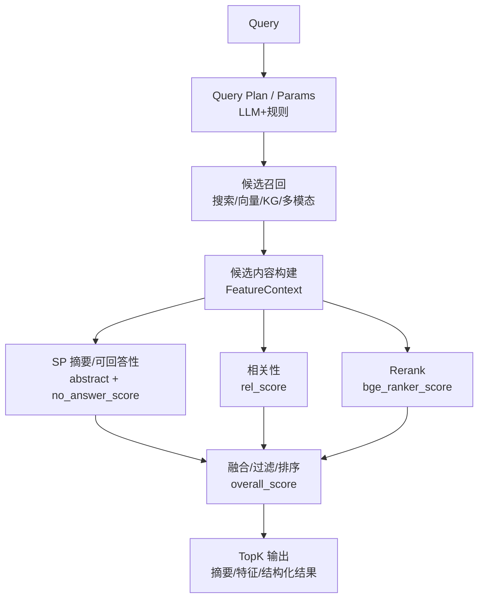
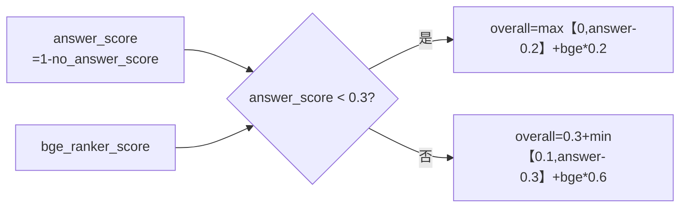
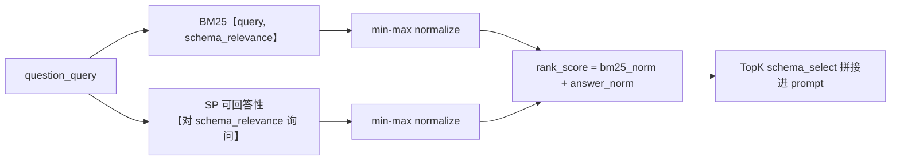
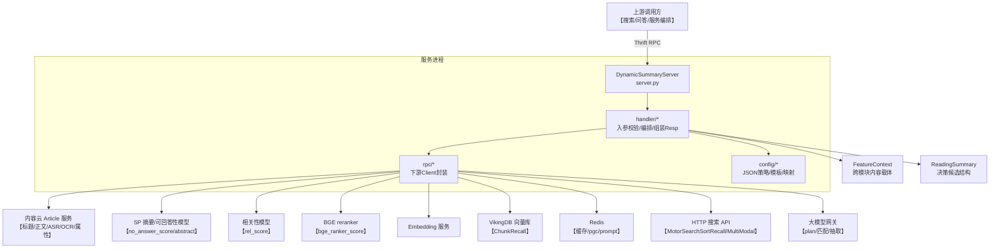
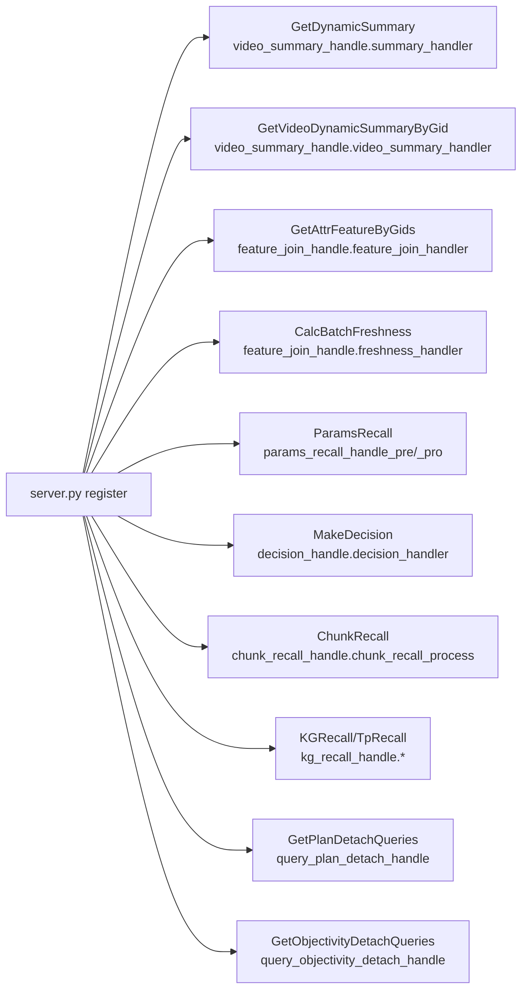
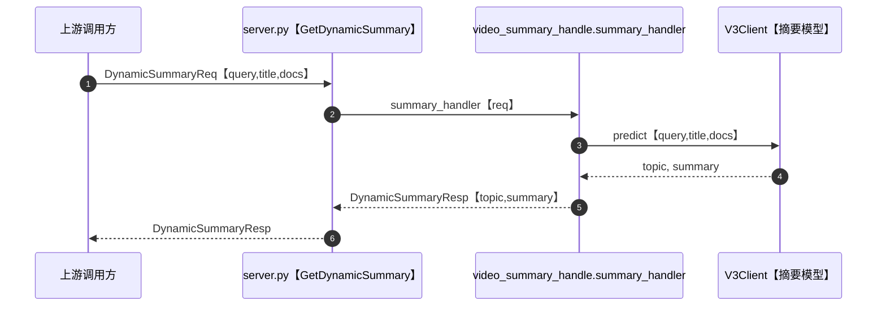
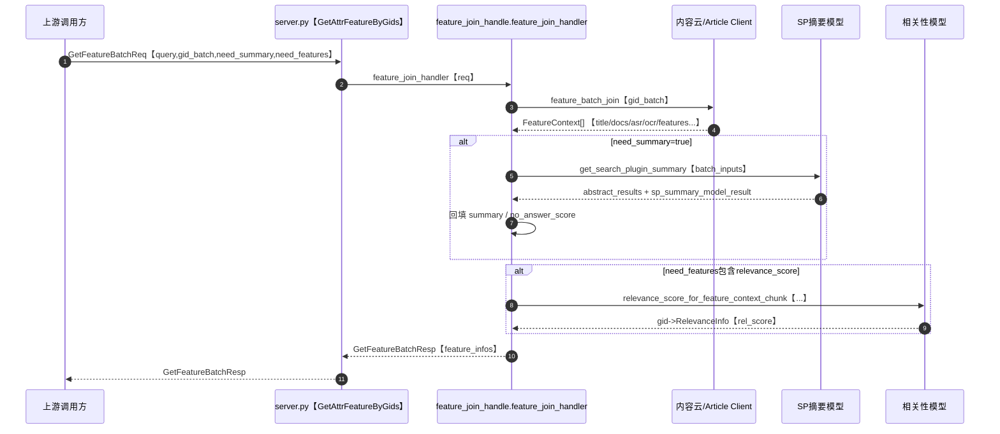
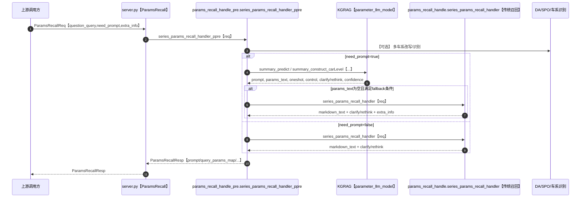
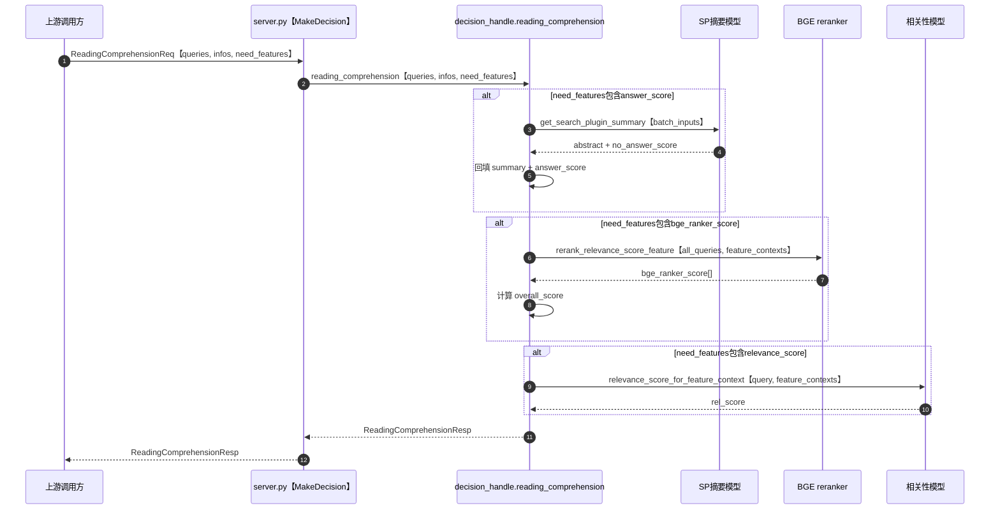
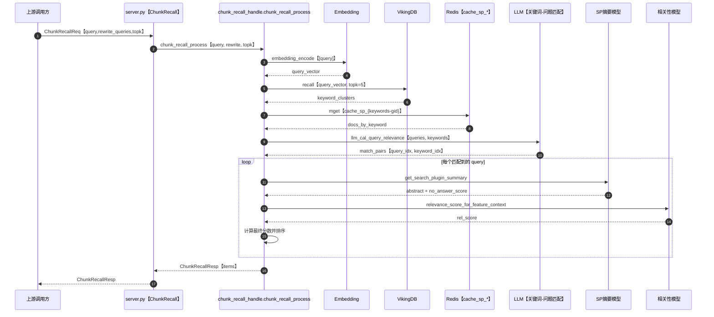

# Motor Dynamic Summary：算法设计（给算法工程师版）

## 1. 目标任务拆解

系统整体可以理解为“检索 + 内容理解 + 结构化特征/参配 + 多分数融合”的服务化封装：

- 摘要：query 与内容（title/docs/asr/ocr/正文）→ abstract + no_answer_score
- 相关性：query 与内容 → rel_score（可基于 chunk/全文/summary 多视角）
- 重排：query 与候选 summary → bge_ranker_score
- 规划/参配：query → select/where（结构化）与参数召回（markdown/prompt parts）

## 2. Mermaid 视图

### 2.1 整体算法流水线

### 2.2 决策打分融合（overall_score）

### 2.3 schema_retrieve 融合（字段相关性）

## 3. 统一数据结构（算法侧接口）

- FeatureContext：承载“一个候选内容”的所有可用信号（文本、多模态字段、分数与特征）。
- thrift 定义：[FeatureContext](file:///cloudide/workspace/motor_dynamic_summary/idls/idl/motor_dynamic_summary.thrift#L48-L70)
- 典型生产：内容云 join + SP 摘要回填，见 [feature_join_handle.py](file:///cloudide/workspace/motor_dynamic_summary/handler/feature_join_handle.py#L23-L155)
- ReadingSummary：用于“多 query、多候选”的决策打分与选择。
- overall_score 由 answer_score 与 bge_ranker_score 融合，见 [decision_handle.py](file:///cloudide/workspace/motor_dynamic_summary/handler/decision_handle.py#L27-L88)

## 4. 核心分数定义与融合

### 3.1 Answer score（可回答性/摘要模型输出）

- 来源：SP 摘要模型输出 SPSummaryModelResult.no_answer_score
- 定义：answer_score = 1 - no_answer_score
- 使用场景：
- ReadingComprehension 的候选摘要与答案分数（决策/过滤）
- schema_retrieve 的相关性近似（见 5.1）

### 3.2 Rerank score（BGE/语义重排）

- 来源：rerank_relevance_score_feature(all_queries, feature_contexts)
- 作用：对候选的 summary（或 content）做 query-候选语义一致性打分，进入 overall。

### 3.3 Overall score（决策融合规则）

实现为分段函数（保证 answer_score 很低时不被 rerank 过度抬高）：

- 若 answer_score < 0.3：overall = max(0, answer-0.2) + bge * 0.2
- 否则：overall = 0.3 + min(0.1, answer-0.3) + bge * 0.6

代码：[decision_handle.py](file:///cloudide/workspace/motor_dynamic_summary/handler/decision_handle.py#L68-L77)

## 5. 规划与参配（Plan / ParamsRecall）

### 5.1 schema_retrieve（字段检索：answer_score + BM25）

在参数规划中，为了把“可能相关的字段 schema”拼进 prompt，使用两路信号融合：

- answer_score：用 SP 模型判断 query 是否能从 schema_relevance 被回答
- bm25_score：query 与 schema_relevance 的 BM25
- rank_score = norm(answer_score) + norm(bm25_score)

代码入口：[plan.py:schema_retrieve](file:///cloudide/workspace/motor_dynamic_summary/llm/plan.py#L288-L381)

### 5.2 qwen 规划输出 → 结构化 params

- 输入：拼接 select_schema/where_schema + query（并注入 DA 的标准车系名可选）
- 模型：qwen_8b_plan（HTTP 推理）
- 解析：parse_multiple_params(qwen_output)
- 映射：process_select_params 将中文字段映射到内部 params_name，并展开聚合属性 include_property

入口：[plan.py:car_base_plan_qwen](file:///cloudide/workspace/motor_dynamic_summary/llm/plan.py#L104-L149)

### 5.3 ParamsRecall（两套版本）

- base/llm_v1：传统召回 + 澄清/改写 + markdown 输出（见 [params_recall_handle.py](file:///cloudide/workspace/motor_dynamic_summary/handler/params_recall_handle.py)）
- qwen_v1：大模型抽取 car_model_text + select_property_list，再驱动参配召回（见 [params_recall_handle_pro.py](file:///cloudide/workspace/motor_dynamic_summary/handler/params_recall_handle_pro.py#L713-L760)）
- need_prompt=true：走 KGRAG 拼接 params_text/oneshot/control/prompt_parts，便于上游直接喂给生成模型
- KGRAG 实现：[parameter_llm_model.py](file:///cloudide/workspace/motor_dynamic_summary/car_series_feature/parameter_llm_model.py)

## 6. ChunkRecall（向量召回 + query-match + 生成摘要/打分）

流程（简化）：

1) query → embedding_encode

2) VikingDB recall → keyword 主题簇

3) Redis mget 拉取缓存 doc（按 keywords-gid 键）

4) LLM 做“keyword ↔ query(含 rewrite)”语义匹配，产出 query2docs

5) 对每个 query：生成摘要 + 相关性 + 最终排序，去重后返回 topk

入口：[chunk_recall_handle.py:chunk_recall_process](file:///cloudide/workspace/motor_dynamic_summary/handler/chunk_recall_handle.py#L181-L220)

算法侧可优化点：

- match 阶段可替换为轻量 cross-encoder 或规则/实体约束，降低 LLM 成本
- 排序阶段显式融合：answer_score、rel_score、freshness、站点黑名单等（当前有部分规则散落在 handler）

## 7. KG/Tp Recall（图谱观点召回）

- 输入：series_list + ents（观点/属性词列表）
- 下游：kg_recall_proxy
- 输出：优点/缺点/一句话总结 + 节点观点明细（opinion_name/polarity/basis/score）

入口：[kg_recall_handle.py](file:///cloudide/workspace/motor_dynamic_summary/handler/kg_recall_handle.py#L80-L185)

## 8. 训练/评估与线上诊断建议

- 分数校准：answer_score 与 bge_ranker_score 的分布漂移要监控（按场景、query 类别、内容类型分桶）
- 离线评估：
- Decision：Top1 命中率/Pairwise accuracy/Calibration
- Recall：NDCG@k/Recall@k/去重率/站点黑名单覆盖
- Plan：字段召回覆盖率（select/where），where 约束正确率（可参考 plan_checker）
- 线上可观测字段（建议写入 extra_info）：模型版本、prompt 版本、关键中间输出（plan xml、match pairs、topk 分数列表）。

---

# Motor Dynamic Summary：系统设计（人能看懂版）

## 1. 系统是什么

本项目提供一个 Thrift RPC 服务（Euler Server），对汽车/摩托搜索与内容理解场景输出：

- 内容摘要（单条/批量，图文/视频）
- 内容特征拼接（FeatureContext）与若干评分（相关性/时效/一致性等）
- 车系/车款参配与车系特征召回（含澄清与 Prompt 组装）
- 若干辅助能力：Query 拆解、Chunk 向量召回、多模态召回、KG 召回、Prompt 组件拼装

入口与 RPC 注册：

- [server.py](file:///cloudide/workspace/motor_dynamic_summary/server.py)
- Thrift 契约：[motor_dynamic_summary.thrift](file:///cloudide/workspace/motor_dynamic_summary/idls/idl/motor_dynamic_summary.thrift)

## 2. 组件分层

- Server 层：Euler + gevent，负责 RPC 注册、异常兜底、日志。
- Handler 层：每个 RPC 对应一个 handler，做入参校验、组织下游调用、组装 thrift response。
- RPC/Client 层：对外部系统（内容云、向量库、模型服务、Redis、HTTP 搜索 API）做封装。
- 配置层：大量策略/模板/映射都在 config/ 下以 JSON 形式加载（参配 schema、prompt 模板、黑名单等）。

## 3. Mermaid 视图

### 3.1 架构总览

### 3.2 关键 RPC → handler 映射

## 4. 关键数据结构

- FeatureContext：跨模块的“内容载体”，包含 gid/title/docs/asr/ocr/summary/features/relevance 等，用于摘要、评分与后续决策。
- 定义见 [motor_dynamic_summary.thrift:FeatureContext](file:///cloudide/workspace/motor_dynamic_summary/idls/idl/motor_dynamic_summary.thrift#L48-L70)
- ReadingSummary：面向“多 query、多候选内容”的阅读理解/决策结构，用于计算 answer/relevance/rerank 并输出 overall。
- 定义见 [motor_dynamic_summary.thrift:ReadingSummary](file:///cloudide/workspace/motor_dynamic_summary/idls/idl/motor_dynamic_summary.thrift#L78-L91)

## 5. 典型调用链（从用户视角）

### 5.1 单条摘要（GetDynamicSummary）

- 输入：query + title + docs
- 处理：调用摘要模型 client（V3Client）
- 输出：topic + summary
- 代码：
- RPC 包装：[server.py:GetDynamicSummary](file:///cloudide/workspace/motor_dynamic_summary/server.py#L77-L92)
- 业务实现：[video_summary_handle.py:summary_handler](file:///cloudide/workspace/motor_dynamic_summary/handler/video_summary_handle.py#L50-L66)

### 5.2 批量特征拼接/摘要（GetAttrFeatureByGids）

- 输入：query + gid_batch（可选 title/docs 直接传入）
- 处理：内容云取 title/docs/asr/ocr + 结构化特征；可选调用 SP 摘要；可选相关性计算。
- 输出：FeatureContext 列表
- 代码：[feature_join_handle.py:feature_join_handler](file:///cloudide/workspace/motor_dynamic_summary/handler/feature_join_handle.py#L23-L155)

### 5.3 参配/车系特征召回（ParamsRecall / CarSeriesFeatureJoin）

- ParamsRecall：根据 query/series_id 等返回 markdown 或 prompt 片段；支持澄清与改写。
- RPC：[server.py:ParamsRecall](file:///cloudide/workspace/motor_dynamic_summary/server.py#L391-L422)
- 默认实现（need_prompt 支持）：[params_recall_handle_pre.py](file:///cloudide/workspace/motor_dynamic_summary/handler/params_recall_handle_pre.py)
- 车系特征 pipeline：[feature_join_handle.py:car_series_feature_handler](file:///cloudide/workspace/motor_dynamic_summary/handler/feature_join_handle.py#L176-L200)

### 5.4 决策（MakeDecision）

- 输入：多个 queries + 每个 query 的候选 ReadingSummary 列表
- 处理：调用 SP 摘要得到 answer_score、调用 reranker 得到 bge_ranker_score，拼 overall_score；可选 relevance。
- 代码：[decision_handle.py](file:///cloudide/workspace/motor_dynamic_summary/handler/decision_handle.py)

### 5.5 ChunkRecall（向量召回 + 匹配 + 摘要/打分）

## 6. 外部依赖（上线必备）

- 内容云（Article 服务）：用于 gid → title/content/asr/ocr/基础特征。
- 摘要/可回答性模型（SP）、相关性/重排模型（bge reranker）、embedding 服务。
- 向量库 VikingDB：ChunkRecall 使用。
- Redis：缓存与部分特征/pgc prompt。
- HTTP 搜索 API：MotorSearchSortRecall / MultiModalRecall。

建议工程实践：将所有外部依赖统一封装成可替换 Client，并支持 offline stub（本地无内网也可跑通主链路）。

## 7. 运行与稳定性

- 并发模型：gevent + monkey patch；部分 handler 内部用 gevent 并发请求下游。
- 异常处理：server.py 对大多数 RPC 做 try/except，失败时写日志并返回 StatusCode=-1。
- 超时/重试：下游 client 各自实现不一致，需要统一治理（建议集中配置）。

## 8. 风险与治理建议

- 密钥/Token：当前代码存在硬编码 Key/Token 的风险，应迁移到环境变量或密钥服务，并禁止日志输出敏感信息。
- 可观测性：建议为每个 RPC 统一记录 req_id、耗时、下游错误码、关键分数分布（answer/relevance/rerank）。
- 契约一致性：thrift service 与 server.register 方法需定期对齐，避免线上/线下行为漂移。
