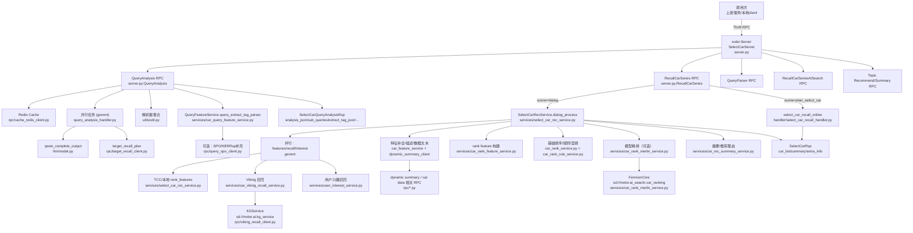
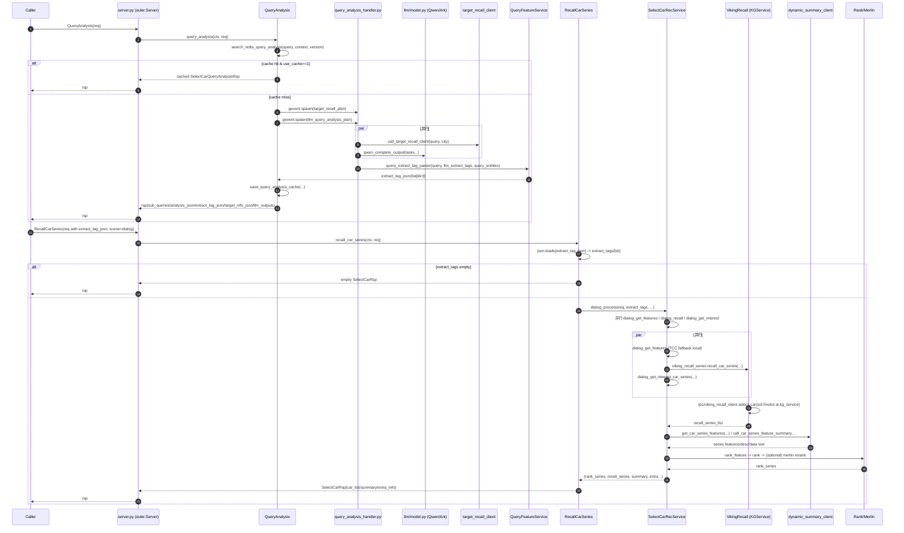

# Select car feature server

> 这个服务本质是“先把用户的话翻译成机器可执行的选车条件，再用条件去召回并排序车系，最后把结果包装成可解释的推荐”。具体流程是：当用户输入一个选车问题时，系统先做一次理解分析，通过大模型并行产出对需求的结构化解读（例如用户显性/隐性需求、可用于检索的子问题、以及按统一字段体系抽出的标签条件），同时还会并行做一次“目标车系/车款识别”来补充可能提到的车型；这些结果会被规范化成一份统一的“标签与特征”结构，并可缓存以加速重复请求。接着进入选车主流程：把结构化标签转成可执行的过滤/召回条件，优先用图谱/检索服务召回一批候选车系（必要时会对过严条件做降级/重启召回），再对召回车系补齐关键信息与描述文本（用于展示和后续打分），然后进入多阶段排序：先做基础打分与规则校正，再视配置启用精排/重排模型与多样性策略，最终生成一个面向用户的摘要和一组排序好的车系列表，并把召回规模、打分细节、命中的标签等调试信息放在扩展字段里便于线上分析与迭代。

下面是一份“Coding Agent 可直接照着复现”的 SOP 级复现文档（以当前仓库为唯一事实来源），目标是把**这套选车服务**从“能跑起来”到“能走通主链路（QueryAnalysis → RecallCarSeries）”完整复现出来，并且明确哪些地方依赖外部/内部服务、如何替换成可复现的 Stub/Mock。

---

## 1. 系统目标与边界

- **系统目标**：对用户选车 Query 做理解与结构化（改写、子问题、标签抽取、目标车系识别等），并基于结构化结果召回/排序车系，输出摘要与候选车系列表。
- **系统形态**：一个 **Thrift RPC 服务**（基于 `euler.Server`），对外暴露多个 RPC 方法（选车主链路、榜单、AI 搜索、话题、首页推荐、车系一图等）。
- **主链路（最重要）**：
  1) `QueryAnalysis`：LLM 并行产出 planning / sub_queries / recall_tags（以及可选回答要点），并可调用 target recall 服务补充车系 NER  
  2) `RecallCarSeries`：将 `extract_tag_json` 转成内部 `query_features`，走召回（Viking KG recall）→ 特征补全（dynamic summary 等）→ 排序/重排（含规则、模型服务等）→ 生成 summary → 返回车系列表

代码入口与 RPC 注册在 [server.py](file:///cloudide/workspace/select_car_feature_server/server.py)。

---

## 2. 仓库结构（你需要理解的模块地图）

- **RPC 服务入口**
  - [server.py](file:///cloudide/workspace/select_car_feature_server/server.py)：euler server 初始化、RPC 方法注册、请求拼装与 response 输出格式
- **LLM**
  - [llm/prompt.py](file:///cloudide/workspace/select_car_feature_server/llm/prompt.py)：所有 prompt 模板（非常大，QueryAnalysis/标签抽取/话题等都在这里）
  - [llm/model.py](file:///cloudide/workspace/select_car_feature_server/llm/model.py)：Ark/Qwen HTTP 调用封装（同步/异步/并发）
- **Query 理解与结构化**
  - [handler/query_analysis_handler.py](file:///cloudide/workspace/select_car_feature_server/handler/query_analysis_handler.py)：QueryAnalysis 的并行 LLM 调用与解析、target recall 补充
  - [utils/util.py](file:///cloudide/workspace/select_car_feature_server/utils/util.py)：解析器集合（`extract_tag_parse / planning_parse / decomposition_parse / analysis_parse / rewrite_parse ...`）
- **选车召回与排序（核心业务）**
  - [services/select_car_rec_service.py](file:///cloudide/workspace/select_car_feature_server/services/select_car_rec_service.py)：dialog 主流程（并行：抽特征/召回/兴趣车系），召回后排序/重排/summary/标签融合
  - [services/car_query_feature_service.py](file:///cloudide/workspace/select_car_feature_server/services/car_query_feature_service.py)：把“标签抽取结果”转成内部可召回的 `SearchQueryFeature/Feature/Property`
  - [services/car_viking_recall_service.py](file:///cloudide/workspace/select_car_feature_server/services/car_viking_recall_service.py)：基于 filters 调用 Viking KG 服务召回车款/聚合车系/重启召回等
  - 排序/重排依赖较多：规则、Merlin/Fermion 模型服务、dynamic summary 特征拼接等（见 6 章外部依赖）
- **Thrift IDL**
  - [idls/idl/motor_select_car.thrift](file:///cloudide/workspace/select_car_feature_server/idls/idl/motor_select_car.thrift)：主 RPC 的所有 request/response 结构定义
  - 其他 thrift 依赖在 [idls/idl/](file:///cloudide/workspace/select_car_feature_server/idls/idl)（大量 include）
- **配置与资源**
  - [config/application.yml](file:///cloudide/workspace/select_car_feature_server/config/application.yml)：LLM endpoint、召回开关、配置文件路径等
  - [config/feature_config/](file:///cloudide/workspace/select_car_feature_server/config/feature_config)：标签体系、映射表、模板等大量 JSON（系统“规则/知识”核心资产）

---

## 3. 对外 RPC 接口一览（复现时先保证这些能被调用）

全部在 [server.py](file:///cloudide/workspace/select_car_feature_server/server.py) 注册，核心包含：

- `QueryAnalysis(SelectCarQueryAnalysisReq) -> SelectCarQueryAnalysisRsp`  
  - 生成：`analysis_json / sub_queries / extract_tag_json / rewrite_query / forward_prompt / target_info_json / llm_outputs ...`
- `RecallCarSeries(SelectCarReq) -> SelectCarRsp`  
  - 对话选车：`scene="dialog"` 或 `scene="plan_select_car"`
- `QueryParser`：判断 query 是否选车意图（轻量）
- `RecallCarRankingSeries`：榜单类召回
- `SelectRecallTagAnalysis`：把“LLM 原始召回标签文本”解析并标准化成 `extract_tag_json`
- 以及 `RecallCarSeriesAISearch / GetTopicRecommend / GetTopicSummary / HomeCarRec / GetCarOnePic / CarExtraction`

接口字段详见 [motor_select_car.thrift](file:///cloudide/workspace/select_car_feature_server/idls/idl/motor_select_car.thrift#L42-L259)。

---

## 4. 核心数据协议（一定要搞清楚的 3 种“标签/特征”形态）

### 4.1 LLM 原始“标签抽取”文本协议

- Prompt：`PROMPTS["extract_prompt_all"]` / `extract_prompt_v3` 等（见 [llm/prompt.py](file:///cloudide/workspace/select_car_feature_server/llm/prompt.py)）
- 解析函数：`extract_tag_parse(text)`（见 [utils/util.py](file:///cloudide/workspace/select_car_feature_server/utils/util.py#L383-L409)）
- 输出形态（Python）：
  - `is_select_car_intent: bool`
  - `extract_tags_list: List[[field_name, value, requirement]]`
  - 例子（抽象）：`["车辆价格", [10,20], "必要"]`

### 4.2 “结构化 extract_tags（供 QueryFeatureService 进一步处理）”

在 QueryAnalysis 里组装为：

```python
extract_tags = {
  "tags": extract_tags_list,        # 来自 extract_tag_parse
  "features": [],                   # 可选：车系特点 extract_feature_parse 产物
  "recall_prompt_tags": extract_output  # 可选：保留原始输出
}
```

组装逻辑见 [query_analysis_handler.llm_query_analysis_plan](file:///cloudide/workspace/select_car_feature_server/handler/query_analysis_handler.py#L36-L99)。

### 4.3 `extract_tag_json`（真正喂给 RecallCarSeries 的 JSON）

RecallCarSeries 接口字段是 `req.extract_tag_json`（string）。在主链路中，它的来源是：

- `process_service.query_service.query_extract_tag_parser(...)`  
  输出是 `List[dict]`，每个 dict 类似：

```json
{
  "level": "车辆价格",
  "desc": "车辆价格",
  "entity": "车辆价格",
  "sentiment": true,
  "weight": 1.0,
  "is_reason": false,
  "entity_feature_type": "CONFIG",
  "search_key": "...",
  "is_match": true,
  "features": [
    {
      "key": "...",
      "param": "...",
      "sentiment": true,
      "use_type": "RECALL|RANK|...",
      "search_key": "...",
      "search_source": "SERIES|CAR|...",
      "search_type": "ENUM|RANGE|...",
      "source": "CONFIG|SUBJECT|...",
      "is_default": false,
      "sort_type": "NONE|ASC|DESC",
      "weight": 1.0,
      "concat": "",
      "range_type": "",
      "range_unit": ""
    }
  ]
}
```

生成逻辑见 [QueryFeatureService.query_extract_tag_parser](file:///cloudide/workspace/select_car_feature_server/services/car_query_feature_service.py#L657-L723)。

**重要**：在 `scene="dialog"` 下，[server.py](file:///cloudide/workspace/select_car_feature_server/server.py#L68-L103) 会把 `req.extract_tag_json` 解析成 list 后直接喂给 `SelectCarRecService.dialog_process(...)`，所以你复现时必须保证这个 JSON 符合上面的 shape。

---

## 5. 主链路时序（Coding Agent 按这个顺序复现）

下面用“必须复现的最小闭环”来描述（先跑通，再逐步补齐能力）。

### 5.1 QueryAnalysis（结构化 Query）

入口：`server.QueryAnalysis` → [server.py](file:///cloudide/workspace/select_car_feature_server/server.py#L331-L416)

关键步骤：

- Cache：`search_redis_query_analysis(query, context, version)`（命中则直接返回）  
- 视频场景特殊改写：`context.startswith("video_needs")`（只做 rewrite）
- 并行执行（gevent）：
  - `target_recall_plan(query, city)`：来自 [query_analysis_handler.target_recall_plan](file:///cloudide/workspace/select_car_feature_server/handler/query_analysis_handler.py#L245-L274)，本质调用 `rpc.target_recall_client`
  - `llm_query_analysis_plan(query, req, context, cate)`：来自 [query_analysis_handler.llm_query_analysis_plan](file:///cloudide/workspace/select_car_feature_server/handler/query_analysis_handler.py#L36-L99)，本质是 qwen/llm 并行产出：
    - `user_needs`（planning）
    - `sub_queries`
    - `recall_tags`
    - （可选）`express_elements`
- 把 `llm_extract_tags` 进一步规范化成 `extract_tag_json`：
  - `process_service.query_service.query_extract_tag_parser(query, llm_extract_tags, query_entities=...)`
- 缓存：`save_query_analysis_cache(...)`

输出：`SelectCarQueryAnalysisRsp` 的关键字段：

- `analysis_json`：planning/analysis
- `sub_queries`
- `extract_tag_json`：RecallCarSeries 需要的“最终结构化标签”
- `extract_recall_tags`：保留 LLM tags 原始结构（便于 debug）
- `rewrite_query`
- `forward_prompt`：由 `get_forward_prompt(rewrite_query, analysis)` 得到

### 5.2 RecallCarSeries（召回 + 排序 + 摘要）

入口：`server.RecallCarSeries` → [server.py](file:///cloudide/workspace/select_car_feature_server/server.py#L52-L173)

对 `scene="dialog"`：

- 若 `extract_tags` 为空：直接返回空结果（[server.py](file:///cloudide/workspace/select_car_feature_server/server.py#L85-L92)）
- 调用主流程：
  - `SelectCarRecService.dialog_process(req, extract_tags=..., version=..., ab_version=..., recall_rank_version=..., car_ner_list=..., need_data_list=..., agentic_tool_plans=...)`
  - 见 [SelectCarRecService.dialog_process](file:///cloudide/workspace/select_car_feature_server/services/select_car_rec_service.py)（核心逻辑很长，但可按下面“分段复现”）

`dialog_process` 内部复现优先级（从“能跑通”到“接近线上”）：

1) **并行阶段**
   - `dialog_get_features(req)`：获取本次排序要用的 feature keys（TCC 或本地 rank_features.json fallback）
   - `dialog_recall(req, extract_tags, ...)`：召回车系（默认走 Viking recall）
   - `dialog_get_interest_car_series(req, ...)`：兴趣车系（可先 stub）
2) **召回结果补全**
   - `car_feature_service.get_car_series_features(...)`：从 dynamic summary / 车库服务补齐车系特征（强依赖外部服务，可先 stub）
3) **排序/重排**
   - simple rank / adaptive_reranking / merlin 模型精排（强依赖外部服务，可先降级为“按召回分数/热度排序”）
4) **summary 生成**
   - `car_summary_service.user_intent_process(...)` 等（可先 stub 返回空）
5) **返回协议拼装**
   - `CarSeriseData` 填充 `rank_score/rerank_score/car_series_feature/data_feature/...`
   - 见 [server.py response packaging](file:///cloudide/workspace/select_car_feature_server/server.py#L124-L172)

---

## 6. 外部/内部依赖清单（复现成败关键）

这个仓库本身“业务逻辑完整”，但运行时严重依赖外部服务与内部 SDK。复现 SOP 必须把它们分层替换，否则 Coding Agent 会卡住。

### 6.1 运行时框架与 Thrift

- `bytedeuler` / `euler`：Thrift server/client + 动态 thrift import hook  
  - 服务端：`euler.Server(SelectCarServer)`（[server.py](file:///cloudide/workspace/select_car_feature_server/server.py#L45-L51)）
  - 客户端示例：见 [client.py](file:///cloudide/workspace/select_car_feature_server/client.py#L19-L121)
- IDL 动态加载：代码里大量 `euler.install_thrift_import_hook()`，且仓库里没有生成的 `*_thrift.py`，意味着**运行时依赖 euler 的 thrift hook** 才能 import 成功。

### 6.2 LLM（Volc Ark / Qwen HTTP）

- Ark 调用封装：`llm_complete / llm_complete_output`（[llm/model.py](file:///cloudide/workspace/select_car_feature_server/llm/model.py#L103-L153)）
- Qwen HTTP：`qwen_complete_output(url, model_name, ...)`（[llm/model.py](file:///cloudide/workspace/select_car_feature_server/llm/model.py#L62-L102)）
- 关键配置来源：
  - [config/application.yml](file:///cloudide/workspace/select_car_feature_server/config/application.yml#L10-L13) 里给了 `endpoint_id`
  - QueryAnalysis 还允许从 `req.ab_json` 覆盖 `llm.url / llm.model_name`（[query_analysis_handler.py](file:///cloudide/workspace/select_car_feature_server/handler/query_analysis_handler.py#L64-L66)）
- 复现注意：当前 [llm/model.py](file:///cloudide/workspace/select_car_feature_server/llm/model.py#L12-L14) 存在硬编码 `api_key`，真实 SOP 中应改为环境变量注入（否则无法在干净环境复现，也有安全风险）。

### 6.3 召回/特征/排序依赖的外部服务（需要 Stub 才能离线复现）

典型包括（只列主链路会碰到的）：

- Viking KG 召回：`rpc.viking_recall_client`（sd://motor.ai.kg_service）  
  - 见 [viking_recall_client.py](file:///cloudide/workspace/select_car_feature_server/rpc/viking_recall_client.py#L39-L174)
- dynamic summary / 车系特征补全：`rpc.dynamic_summary_client`（多处调用，决定 `car_series_desc/data_feature`）
- TCC 配置：`bytedtcc.ClientV2`（rank_extract_features 等）  
  - fallback 本地文件：`config/feature_config/rank_features.json`（见 [select_car_rec_service.py](file:///cloudide/workspace/select_car_feature_server/services/select_car_rec_service.py#L78-L92)）
- Merlin/Fermion 排序模型服务：`sd://motor.ai_search.car_ranking` 等  
  - 见 [car_rank_merlin_service.py](file:///cloudide/workspace/select_car_feature_server/services/car_rank_merlin_service.py#L180-L209)
- Redis cache：`bytedredis.Client("toutiao.redis.select_car_data")`  
  - 见 [cache_redis_client.py](file:///cloudide/workspace/select_car_feature_server/rpc/cache_redis_client.py#L9-L35)
- 车库/价格/评测/口碑等：大量 `rpc/*_client.py`（sd://motor.xxx）

**结论**：如果你的复现环境拿不到这些 `sd://` 服务与内部 SDK，必须走“离线替身方案”（见 8 章）。

---

## 7. 本地启动 SOP（有内部依赖的“生产近似复现”）

> 前提：环境可安装/访问 `bytedeuler/bytedredis/bytedtcc/bytedes/...`，且网络能访问 `sd://...` 服务与火山 Ark。

- **步骤 1：准备 Python 环境**
  - 推荐 Python 3.9（仓库自带 `.venv` 痕迹显示为 3.9）
  - 安装依赖：`pip install -r requirements.txt`（见 [requirements.txt](file:///cloudide/workspace/select_car_feature_server/requirements.txt)）
- **步骤 2：检查配置**
  - [config/application.yml](file:///cloudide/workspace/select_car_feature_server/config/application.yml)：
    - `llm.endpoint_id / doubao_endpoint_id`
    - `viking.use_viking_recall`（默认 true）
    - `es.ues_recall`（拼写就是 `ues_recall`，不要改错）
  - 模板/标签文件路径都在 yml 里，确保相对路径可读
- **步骤 3：启动服务**
  - 启动脚本是 [bootstrap.sh](file:///cloudide/workspace/select_car_feature_server/bootstrap.sh)：
    - 实际执行：`python -m gevent.monkey server.py`
  - 服务监听：`tcp://0.0.0.0:1234`（见 [server.py main](file:///cloudide/workspace/select_car_feature_server/server.py#L622-L626)）
- **步骤 4：用 client 验证主链路**
  - [client.py](file:///cloudide/workspace/select_car_feature_server/client.py) 提供了完整 pipeline：
    - 先 `QueryAnalysis`
    - 再把 `analysis_json/sub_queries/extract_tag_json` 填回 `SelectCarReq` 调 `RecallCarSeries`
  - 样例函数：`test_pipeline / scratch_seroes`

---

## 8. 离线可复现 SOP（Coding Agent 最常用：把外部依赖全部 Stub 掉）

如果复现目标是“把系统实现逻辑跑通 + 可验证输出结构正确”，推荐按以下**降级策略**实现“可运行的闭环”，并且保持接口与数据结构不变：

### 8.1 离线复现分层目标（强烈建议按顺序达成）

- **Level 1：服务能启动 + RPC 可调用**
  - 允许 QueryAnalysis/RecallCarSeries 返回空但结构正确
- **Level 2：QueryAnalysis 不依赖外部 LLM**
  - 用本地 deterministic 规则/fixture 输出 `llm_outputs/extract_tags/sub_queries`
- **Level 3：RecallCarSeries 不依赖 Viking/dynamic/merlin**
  - 用本地小车系库（例如 20 条）做召回与排序
- **Level 4：逐步接回真实能力**
  - 先接 LLM，再接 Viking，再接 dynamic summary，再接排序模型

### 8.2 需要 Stub 的关键点（按调用频率排序）

- LLM：替换 [llm/model.py](file:///cloudide/workspace/select_car_feature_server/llm/model.py) 的 `llm_complete* / qwen_complete_output` 返回固定 JSON（保持 prompt→output 的解析格式一致）
- Viking recall：替换 [rpc/viking_recall_client.py](file:///cloudide/workspace/select_car_feature_server/rpc/viking_recall_client.py) 的 `call_recall_car_client / call_tag_recall_client`
- dynamic summary：替换 `rpc.dynamic_summary_client` 中所有 `call_*`（仓库里被多处 service 调用）
- Merlin/Fermion 排序：让 `inferByFeatures` 直接按已有字段排序
- Redis/TCC：让 cache 与配置读取走本地内存/本地 JSON（项目已经对 TCC 做了本地 fallback）

### 8.3 离线数据最小集（必须准备）

- 车系基础表：`series_id, series_name, 若干特征(feature dict), 描述`
- 标签映射/字段体系：尽量复用现成配置（[config/feature_config](file:///cloudide/workspace/select_car_feature_server/config/feature_config)）
- rank_features：直接用本地 `config/feature_config/rank_features.json`（代码已有 fallback）

### 8.4 离线回归用例（用于验证“逻辑复现成功”）

用 [client.py](file:///cloudide/workspace/select_car_feature_server/client.py) 的 pipeline，至少覆盖：

- 典型选车：预算/车型/能源/座位数/用途混合
- 非选车：应被 QueryParser/QueryAnalysis 判为无需检索或返回空 tags
- 候选车系明确：包含车系名（验证“候选车系”路径）

验收标准：

- `QueryAnalysisRsp.extract_tag_json` 是合法 JSON，且每个元素都有 `level/entity/features[]`
- `RecallCarSeriesRsp.car_list` 返回 `CarSeriseData` 列表，至少包含 `car_series_id/name/desc`，并且 `BaseResp.StatusCode==0`

---

## 9. 关键实现逻辑拆解（Coding Agent 读代码时的“抓手”）

### 9.1 QueryAnalysis 的并行任务是可配置的

- 默认并行 tasks 在 [query_analysis_handler.py](file:///cloudide/workspace/select_car_feature_server/handler/query_analysis_handler.py#L45-L50)
- 可通过 `req.ab_json.parallel_tasks` 覆盖（这也是线上灰度/AB 的入口）

### 9.2 “标签抽取 → 可召回特征”转换是全系统中最关键的粘合层

- 把 LLM 的 `["字段", 值, 倾向性]` 转成内部实体/属性/召回过滤条件的核心在：
  - `EntityRecognitionHandler.extract_tag_process(...)`
  - `QueryFeatureService.parser_process(...)`
  - 最终由 `QueryFeatureService.query_extract_tag_parser(...)` 输出 `extract_tag_json`
- 反序列化回来走召回时，用 `QueryFeatureService.extract_tag_to_feature(...)`（[car_query_feature_service.py](file:///cloudide/workspace/select_car_feature_server/services/car_query_feature_service.py#L725-L769)）

### 9.3 Recall 主路径默认走 Viking（不是 ES）

- `SelectCarRecService.dialog_recall` 内部直接调用：
  - `self.viking_recall_series.recall_car_series(...)`（[select_car_rec_service.py](file:///cloudide/workspace/select_car_feature_server/services/select_car_rec_service.py#L175-L208)）
- ES recall 相关实现虽然存在，但主流程默认不走（仓库里多处标注/注释）

---

## 10. 最小“复现清单”（Coding Agent 的执行 Checklist）

- 能 import 并启动 [server.py](file:///cloudide/workspace/select_car_feature_server/server.py)（解决 euler/thrift 动态加载问题）
- 能调用 `QueryAnalysis` 并拿到：
  - `rewrite_query / sub_queries / extract_tag_json`
- 能把 `extract_tag_json` 填到 `SelectCarReq.extract_tag_json`，调用 `RecallCarSeries(scene="dialog")` 拿到 `car_list`
- 离线环境下：
  - 所有 `sd://...` / redis / tcc / dynamic / merlin 调用点都有 stub 或降级分支
  - 输出字段结构与 thrift 定义一致（见 [motor_select_car.thrift](file:///cloudide/workspace/select_car_feature_server/idls/idl/motor_select_car.thrift)）

---

如果你希望我把“离线可复现方案”直接落实为代码改造（在不改接口的前提下提供 stub 开关、内置小样本车系库、让 client 一键跑通），我可以按上面 8 章的分层目标直接给出可审查的补丁；你只需要指定你希望达到的复现层级（Level 2/3/4）。

```md
## **一、给人能看懂的系统设计逻辑（宏观架构 + 主流程）**

### 1) 这个服务是什么

- 这是一个 **Thrift RPC 服务**（基于 Euler），对外提供“选车理解 + 车系召回排序 + 摘要/解释”的能力。
- 服务入口在 [server.py](https://vscode-remote+icube-002bicube.vscode-resource.vscode-cdn.net/home/byteide/.byted-ide/extensions/byted-cannycoder.cannycoder-2.9.13-universal/)，启动监听 `tcp://0.0.0.0:1234`（[server.py:L622-L626](https://vscode-remote+icube-002bicube.vscode-resource.vscode-cdn.net/home/byteide/.byted-ide/extensions/byted-cannycoder.cannycoder-2.9.13-universal/)）。

### 2) 核心输入输出

- 输入：用户 query + 场景（dialog / plan_select_car 等）+（可选）上下文 context、城市、AB 参数、需要补充的数据类型 need_data_list 等（IDL 在 [motor_select_car.thrift](https://vscode-remote+icube-002bicube.vscode-resource.vscode-cdn.net/home/byteide/.byted-ide/extensions/byted-cannycoder.cannycoder-2.9.13-universal/)）。
- 输出：候选车系列表（带排序分、重排分、车系描述、可选结构化数据/agentic plan 拼接结果）+ 摘要 summary + debug extra_info（见 [motor_select_car.thrift:SelectCarRsp](https://vscode-remote+icube-002bicube.vscode-resource.vscode-cdn.net/home/byteide/.byted-ide/extensions/byted-cannycoder.cannycoder-2.9.13-universal/)）。

### 3) 两段式主链路：先“理解”，再“选车”

主链路通常是两次 RPC：

1. **QueryAnalysis**：把自然语言需求变成结构化信息
    - 产出：`rewrite_query / sub_queries / extract_tag_json / forward_prompt / target_info_json / llm_outputs`
    - 入口在 [server.py:QueryAnalysis](https://vscode-remote+icube-002bicube.vscode-resource.vscode-cdn.net/home/byteide/.byted-ide/extensions/byted-cannycoder.cannycoder-2.9.13-universal/)，核心实现依赖 [query_analysis_handler.py](https://vscode-remote+icube-002bicube.vscode-resource.vscode-cdn.net/home/byteide/.byted-ide/extensions/byted-cannycoder.cannycoder-2.9.13-universal/)。
2. **RecallCarSeries**：基于结构化标签召回并排序车系
    - 在 dialog 场景要求 `extract_tag_json` 非空，否则直接返回空（[server.py:L85-L92](https://vscode-remote+icube-002bicube.vscode-resource.vscode-cdn.net/home/byteide/.byted-ide/extensions/byted-cannycoder.cannycoder-2.9.13-universal/)）。
    - 主流程由 `SelectCarRecService.dialog_process` 驱动（[select_car_rec_service.py](https://vscode-remote+icube-002bicube.vscode-resource.vscode-cdn.net/home/byteide/.byted-ide/extensions/byted-cannycoder.cannycoder-2.9.13-universal/)），最终在 server 层封装为 `CarSeriseData` 返回（[server.py:L124-L172](https://vscode-remote+icube-002bicube.vscode-resource.vscode-cdn.net/home/byteide/.byted-ide/extensions/byted-cannycoder.cannycoder-2.9.13-universal/)）。

### 4) 系统内部模块怎么分工（“分层”理解）

- **LLM 层**：负责“理解/拆解/抽标签/规划输出”
    - Prompt 都在 [llm/prompt.py](https://vscode-remote+icube-002bicube.vscode-resource.vscode-cdn.net/home/byteide/.byted-ide/extensions/byted-cannycoder.cannycoder-2.9.13-universal/)
    - 调用封装在 [llm/model.py](https://vscode-remote+icube-002bicube.vscode-resource.vscode-cdn.net/home/byteide/.byted-ide/extensions/byted-cannycoder.cannycoder-2.9.13-universal/)
- **特征解释层（QueryFeatureService）**：把“抽到的标签”转换成系统可执行的召回/过滤/排序特征
    - 关键在 [car_query_feature_service.py](https://vscode-remote+icube-002bicube.vscode-resource.vscode-cdn.net/home/byteide/.byted-ide/extensions/byted-cannycoder.cannycoder-2.9.13-universal/) 的 `query_extract_tag_parser` 与 `extract_tag_to_feature`（见 [car_query_feature_service.py:L657-L769](https://vscode-remote+icube-002bicube.vscode-resource.vscode-cdn.net/home/byteide/.byted-ide/extensions/byted-cannycoder.cannycoder-2.9.13-universal/)）。
- **召回层**：根据特征从知识库/图谱/向量检索等召回候选
    - 默认走 Viking KG 召回服务（见 [select_car_rec_service.py:L142-L208](https://vscode-remote+icube-002bicube.vscode-resource.vscode-cdn.net/home/byteide/.byted-ide/extensions/byted-cannycoder.cannycoder-2.9.13-universal/) 与 [car_viking_recall_service.py](https://vscode-remote+icube-002bicube.vscode-resource.vscode-cdn.net/home/byteide/.byted-ide/extensions/byted-cannycoder.cannycoder-2.9.13-universal/)）。
- **排序/重排层**：规则 + 轻量排序 + 模型精排（Merlin/Fermion）
    - Merlin 排序入口在 [car_rank_merlin_service.py](https://vscode-remote+icube-002bicube.vscode-resource.vscode-cdn.net/home/byteide/.byted-ide/extensions/byted-cannycoder.cannycoder-2.9.13-universal/)。
- **摘要/解释层**：把“用户需求 + 车型特征 + 排序结果”产出 summary / 推荐理由
    - 由 `CarRecSummaryService` 等负责（见 repo 内 services 目录，`SelectCarRecService` 会调用其方法）。

### 5) 场景分叉

- `scene="dialog"`：标准选车对话，依赖 `extract_tag_json`，完整走召回+排序+summary（[server.py:L85-L172](https://vscode-remote+icube-002bicube.vscode-resource.vscode-cdn.net/home/byteide/.byted-ide/extensions/byted-cannycoder.cannycoder-2.9.13-universal/)）。
- `scene="plan_select_car"`：计划/工具化选车（会走 [handler/select_car_recall_handler.py](https://vscode-remote+icube-002bicube.vscode-resource.vscode-cdn.net/home/byteide/.byted-ide/extensions/byted-cannycoder.cannycoder-2.9.13-universal/) 的在线入口 `select_car_recall_online`，再回到服务做排序/数据补充）。
- `RecallCarSeriesAISearch`：另一条 AI-search 风格链路（见 [select_car_ai_search_service.py](https://vscode-remote+icube-002bicube.vscode-resource.vscode-cdn.net/home/byteide/.byted-ide/extensions/byted-cannycoder.cannycoder-2.9.13-universal/)）。

---

## **二、给算法工程师看的设计逻辑（数据结构、特征、模型、AB、可观测、降级）**

### 1) 关键数据结构：系统里“标签/特征”的三种形态

**(A) LLM 原始标签抽取输出（文本协议）**

- 解析器在 [utils/util.py:extract_tag_parse](https://vscode-remote+icube-002bicube.vscode-resource.vscode-cdn.net/home/byteide/.byted-ide/extensions/byted-cannycoder.cannycoder-2.9.13-universal/)。
- 它会从形如：
    - `<标签抽取> 字段##值##倾向性 ... </标签抽取>` 解析成 `List[[field, value, requirement]]`，其中 value 支持 `"[a,b]"` 解析（[utils/util.py:tag_value_load](https://vscode-remote+icube-002bicube.vscode-resource.vscode-cdn.net/home/byteide/.byted-ide/extensions/byted-cannycoder.cannycoder-2.9.13-universal/)）。

**(B) QueryAnalysis 阶段的中间结构 `extract_tags`**

- 结构：
    - `{"tags": extract_tags_list, "features": extract_feature_list, "recall_prompt_tags": raw_output}`
- 生成位置：
    - [query_analysis_handler.py:L87-L98](https://vscode-remote+icube-002bicube.vscode-resource.vscode-cdn.net/home/byteide/.byted-ide/extensions/byted-cannycoder.cannycoder-2.9.13-universal/)

**(C) 真正喂给 RecallCarSeries 的 `extract_tag_json`（强约束 JSON）**

- 由 `QueryFeatureService.query_extract_tag_parser` 生成（[car_query_feature_service.py:L657-L723](https://vscode-remote+icube-002bicube.vscode-resource.vscode-cdn.net/home/byteide/.byted-ide/extensions/byted-cannycoder.cannycoder-2.9.13-universal/)）。
- 每个元素是一个“可执行的 SearchQueryFeature dict”，包含：
    - `level/desc/entity/sentiment/weight/entity_feature_type/search_key/is_match`
    - `features[]`：每个 feature 带 `key/param/use_type/search_type/search_source/source/sort_type/weight/...`
- Recall 阶段会把它反序列化成内部对象（`SearchQueryFeature/Feature/Property`）：
    - [car_query_feature_service.py:extract_tag_to_feature](https://vscode-remote+icube-002bicube.vscode-resource.vscode-cdn.net/home/byteide/.byted-ide/extensions/byted-cannycoder.cannycoder-2.9.13-universal/)

对算法同学的意义：

你们训练/推理阶段产出的标签，最终必须落到 C 这种结构，否则召回/排序链路不认识。

---

### 2) QueryAnalysis：并行任务、输出解析、可灰度

实现入口：[server.py:QueryAnalysis](https://vscode-remote+icube-002bicube.vscode-resource.vscode-cdn.net/home/byteide/.byted-ide/extensions/byted-cannycoder.cannycoder-2.9.13-universal/)

**(1) 并行两条任务**

- `target_recall_plan(query, city)`：调用外部 target recall 服务，产出 `car_ner_list/target_content`（[query_analysis_handler.py:L245-L274](https://vscode-remote+icube-002bicube.vscode-resource.vscode-cdn.net/home/byteide/.byted-ide/extensions/byted-cannycoder.cannycoder-2.9.13-universal/)）
- `llm_query_analysis_plan(query, req, context, cate)`：并行跑多个 LLM task（[query_analysis_handler.py:L36-L99](https://vscode-remote+icube-002bicube.vscode-resource.vscode-cdn.net/home/byteide/.byted-ide/extensions/byted-cannycoder.cannycoder-2.9.13-universal/)）

**(2) 可配置任务列表（AB 参数入口）**

- 默认 tasks：`query_planning_base / query_decomposition_all / extract_prompt_all / query_express_elements`
    
    在 [query_analysis_handler.py:L45-L50](https://vscode-remote+icube-002bicube.vscode-resource.vscode-cdn.net/home/byteide/.byted-ide/extensions/byted-cannycoder.cannycoder-2.9.13-universal/)
- 可以通过 `req.ab_json.parallel_tasks` 覆盖 enable/max_tokens/key/name。
- qwen HTTP 的 `url/model_name` 也可通过 `ab_json.llm.url / ab_json.llm.model_name` 覆盖（[query_analysis_handler.py:L64-L66](https://vscode-remote+icube-002bicube.vscode-resource.vscode-cdn.net/home/byteide/.byted-ide/extensions/byted-cannycoder.cannycoder-2.9.13-universal/)）。

**(3) 解析器约束**

- planning 解析：`planning_parse`（[utils/util.py:L495-L511](https://vscode-remote+icube-002bicube.vscode-resource.vscode-cdn.net/home/byteide/.byted-ide/extensions/byted-cannycoder.cannycoder-2.9.13-universal/)）
- sub_queries 解析：`decomposition_parse`（[utils/util.py:L513-L523](https://vscode-remote+icube-002bicube.vscode-resource.vscode-cdn.net/home/byteide/.byted-ide/extensions/byted-cannycoder.cannycoder-2.9.13-universal/)）
- recall_tags 解析：`extract_tag_parse`（[utils/util.py:L383-L409](https://vscode-remote+icube-002bicube.vscode-resource.vscode-cdn.net/home/byteide/.byted-ide/extensions/byted-cannycoder.cannycoder-2.9.13-universal/)）
- 这意味着：**LLM 输出格式错误会导致整条链路标签为空**，进而 dialog 场景直接无结果（[server.py:L85-L92](https://vscode-remote+icube-002bicube.vscode-resource.vscode-cdn.net/home/byteide/.byted-ide/extensions/byted-cannycoder.cannycoder-2.9.13-universal/)）。

---

### 3) RecallCarSeries（dialog）：召回、特征补全、排序/重排

入口：[server.py:RecallCarSeries](https://vscode-remote+icube-002bicube.vscode-resource.vscode-cdn.net/home/byteide/.byted-ide/extensions/byted-cannycoder.cannycoder-2.9.13-universal/)

核心在 `SelectCarRecService.dialog_process`：

- 初始化注入了一整套子服务：实体识别、QueryFeature、召回、特征、排序、规则、Merlin、总结等（[select_car_rec_service.py:L50-L73](https://vscode-remote+icube-002bicube.vscode-resource.vscode-cdn.net/home/byteide/.byted-ide/extensions/byted-cannycoder.cannycoder-2.9.13-universal/)）。

**(1) 召回：默认 Viking**

- `dialog_recall` 会把 `extract_tags` 中 SUBJECT（且不等于“热门”）聚合成 `kg_ents`，并把未命中标签也加入 kg 召回（[select_car_rec_service.py:L142-L190](https://vscode-remote+icube-002bicube.vscode-resource.vscode-cdn.net/home/byteide/.byted-ide/extensions/byted-cannycoder.cannycoder-2.9.13-universal/)）
- 真正召回调用：`CarVikingRecallService.recall_car_series`（见 [select_car_rec_service.py:L175-L178](https://vscode-remote+icube-002bicube.vscode-resource.vscode-cdn.net/home/byteide/.byted-ide/extensions/byted-cannycoder.cannycoder-2.9.13-universal/)）
- Viking 的底层 RPC client 在 [rpc/viking_recall_client.py](https://vscode-remote+icube-002bicube.vscode-resource.vscode-cdn.net/home/byteide/.byted-ide/extensions/byted-cannycoder.cannycoder-2.9.13-universal/)（`sd://motor.ai.kg_service?cluster=default`）。

**(2) 特征补全：dynamic summary/车系特征服务**

- 召回完会调用 `car_feature_service.get_car_series_features(...)` 做车系特征补齐（[select_car_rec_service.py:L178-L179](https://vscode-remote+icube-002bicube.vscode-resource.vscode-cdn.net/home/byteide/.byted-ide/extensions/byted-cannycoder.cannycoder-2.9.13-universal/)）。
    
    这一步通常决定：
    - `car_series_desc`（给用户看的描述）
    - `data_feature`（基础数据、亮点、对比等结构化文本）
    - `car_models` 等细粒度信息

**(3) 排序/重排：多策略叠加** 你可以把它理解成“多阶段 rerank”：

- 基础排序特征构建：`car_rank_feature_service.get_series_rank_feature(...)`
- 排序器：`car_rank_service.rank_car_series(...)`
- 规则服务：`car_rule_service`（用于过滤/修正）
- 模型精排：Merlin/Fermion（[car_rank_merlin_service.py](https://vscode-remote+icube-002bicube.vscode-resource.vscode-cdn.net/home/byteide/.byted-ide/extensions/byted-cannycoder.cannycoder-2.9.13-universal/)）
- 轻量策略：`adaptive_ranking / adaptive_reranking / diversity_shuffle`（在 [select_car_rec_service.py](https://vscode-remote+icube-002bicube.vscode-resource.vscode-cdn.net/home/byteide/.byted-ide/extensions/byted-cannycoder.cannycoder-2.9.13-universal/) 内部多处调用）

对算法同学：

排序阶段的关键输入通常是 `query + analysis_json + recall_features/rerank_features + 动态特征文本`，模型接口如果要迭代，尽量保持输入 schema 稳定（否则上游改动面很大）。

---

### 4) AB 参数与实验点（你们最常用的“控场”开关）

系统里 AB 参数主要从：

- `SelectCarReq.ab_json`（Recall 阶段）
- `SelectCarQueryAnalysisReq.ab_json`（QueryAnalysis 阶段）

常见用途：

- QueryAnalysis：控制并行 task、qwen url/model、token 上限等（[query_analysis_handler.py:L45-L66](https://vscode-remote+icube-002bicube.vscode-resource.vscode-cdn.net/home/byteide/.byted-ide/extensions/byted-cannycoder.cannycoder-2.9.13-universal/)）
- Recall/Rank：控制 topk、rank 阈值、候选数、是否启用某个精排策略等（见 [select_car_rec_service.py] 内 `json_get(ab_params, ["rank_params", ...])` 的用法，搜索结果在该文件多处）。

---

### 5) 可观测性与 Debug 载荷（线上排障抓手）

- 日志：统一走 loguru + bytedlogger handler（[utils/log.py](https://vscode-remote+icube-002bicube.vscode-resource.vscode-cdn.net/home/byteide/.byted-ide/extensions/byted-cannycoder.cannycoder-2.9.13-universal/)）
- RecallCarSeries 的 `extra_info` 会塞入很多 debug 字段：
    - recall_size / rank_series / rerank_result / simple_rank_result / kg_recall_ents / tag_selected_map 等（见 [server.py:L104-L167](https://vscode-remote+icube-002bicube.vscode-resource.vscode-cdn.net/home/byteide/.byted-ide/extensions/byted-cannycoder.cannycoder-2.9.13-universal/)）
- QueryAnalysis 会返回 `llm_outputs`（不同 task 的原始 output），以及 `target_info_json`（target recall 的 NER 信息）（[server.py:L400-L408](https://vscode-remote+icube-002bicube.vscode-resource.vscode-cdn.net/home/byteide/.byted-ide/extensions/byted-cannycoder.cannycoder-2.9.13-universal/)）

---

### 6) 依赖与风险点（算法侧必须知道的“系统约束”）

- **强依赖外部 RPC**：Viking KG、dynamic summary、Merlin/Fermion、Redis、TCC 等（大量 `sd://...` 客户端在 `rpc/` 下）。
- **强格式约束**：LLM 输出格式一旦偏离（比如 JSON 不可 parse / 标签块不完整），就会导致 `extract_tag_json` 为空，从而 dialog 场景直接无结果。
- **配置与资源依赖**：大量标签体系与映射在 [config/feature_config](https://vscode-remote+icube-002bicube.vscode-resource.vscode-cdn.net/home/byteide/.byted-ide/extensions/byted-cannycoder.cannycoder-2.9.13-universal/)；rank_features 支持 TCC 失败时回落本地（[select_car_rec_service.py:L78-L92](https://vscode-remote+icube-002bicube.vscode-resource.vscode-cdn.net/home/byteide/.byted-ide/extensions/byted-cannycoder.cannycoder-2.9.13-universal/)）。
- **安全风险提示（重要）**：当前 [llm/model.py](https://vscode-remote+icube-002bicube.vscode-resource.vscode-cdn.net/home/byteide/.byted-ide/extensions/byted-cannycoder.cannycoder-2.9.13-universal/) 存在硬编码 `api_key`，设计上应改成环境变量/密钥管理注入，否则无法合规复现与上线。

---

如果你愿意，我可以把这两份设计逻辑进一步“产品化”为：

- 一张分层架构图（文字版/mermaid 版）
- 一张主链路时序图（QueryAnalysis → RecallCarSeries）
- 一份“算法改模型/改 prompt/加特征”该改哪些点、哪些点不能动的变更指南（含回归用例与验收口径）
```





# Motor dynamic summary

> 整个系统可以理解为一个“把用户问题变成可用答案/摘要”的服务编排器：上游丢进来一个问题（可能还带若干候选内容或 gid），系统先把内容凑齐（从外部内容源拿到标题、正文、ASR/OCR 等，并统一装进同一种内容载体），然后按需求并行调用几类模型与检索能力——用摘要/可回答性模型判断“这条内容能不能答这个问题并顺便生成摘要”，用相关性与重排模型给候选内容打分排序，用向量库做 chunk 级召回补充证据，用知识图谱补充车系优缺点/观点，用大模型做 query 拆解与结构化规划（比如该查哪些参配字段、需不需要澄清或改写问题），最后把这些结果按接口需要组装成输出（摘要、TopK 候选、参配 markdown 或可直接喂给生成模型的 prompt 组件、以及用于诊断的分数与 extra 信息），并在失败时降级返回可用的最小结果。

下面给的是一份“Coding Agent 可直接照着复现”的开发 SOP 级复现文档：从接口→服务框架→各模块数据流→外部依赖抽象→测试与验收。内容基于当前仓库实现（不是理想化重写），并附关键代码入口的可点击引用，方便快速定位。

---

## **1. 目标与边界**

- **目标**：复现一个 Thrift RPC 服务 `DynamicSummaryServer`，提供“摘要/特征拼接/多种打分/参数召回/检索召回/Prompt 组件”等能力，对齐当前仓库行为。
- **边界**：仓库大量依赖公司内基础设施（Euler 服务发现、内容云、VikingDB、Redis、内部模型服务、Ark/火山大模型网关等）。要“成功复现”，必须把这些依赖抽象成可替换的 Client，并提供本地 stub/mock 运行模式（否则本地会大量 Connection refused/timeout）。

---

## **2. 系统总览（架构与代码地图）**

### **2.1 目录结构（建议 Coding Agent 先建立 mental model）**

- **服务入口**
  - [server.py](file:///cloudide/workspace/motor_dynamic_summary/server.py)：Euler Thrift Server，注册所有 RPC 方法（唯一总入口）。
  - [bootstrap.sh](file:///cloudide/workspace/motor_dynamic_summary/bootstrap.sh)：本地启动脚本（gevent monkey patch）。
- **接口定义（契约）**
  - [motor_dynamic_summary.thrift](file:///cloudide/workspace/motor_dynamic_summary/idls/idl/motor_dynamic_summary.thrift#L114-L682)：请求/响应结构体 + service 方法清单。
- **业务 Handler（RPC 方法的实现落点）**
  - `handler/`：每个 RPC 方法基本对应一个 `*_handle.py` 或函数。
  - 示例：摘要相关在 [video_summary_handle.py](file:///cloudide/workspace/motor_dynamic_summary/handler/video_summary_handle.py)；特征拼接在 [feature_join_handle.py](file:///cloudide/workspace/motor_dynamic_summary/handler/feature_join_handle.py#L23-L200)；参数召回入口在 [params_recall_handle_pre.py](file:///cloudide/workspace/motor_dynamic_summary/handler/params_recall_handle_pre.py#L63-L187)。
- **下游 RPC Client & 外部能力封装**
  - `rpc/`：对内容云、召回、embedding、ranker、评分等下游的调用封装。
  - 例：内容云/特征 join 在 [feature_join_client.py](file:///cloudide/workspace/motor_dynamic_summary/rpc/feature_join_client.py#L80-L205)。
- **LLM/规划/Prompt**
  - `llm/`：大模型调用封装、规划生成、校验、Prompt 工厂。
  - 例：规划主流程在 [plan.py](file:///cloudide/workspace/motor_dynamic_summary/llm/plan.py#L104-L381)，大模型调用在 [dcd_llm.py](file:///cloudide/workspace/motor_dynamic_summary/llm/dcd_llm.py#L23-L210)。
- **车系特征与参数工程**
  - `car_series_feature/`：车系特征 pipeline、参数 schema、markdown 组装、车款过滤等。

### **2.2 服务启动与 RPC 注册（总入口）**

- Server 启动采用 `gevent + euler.Server(DynamicSummaryServer)`，并 `monkey.patch_all()`，见 [server.py](file:///cloudide/workspace/motor_dynamic_summary/server.py#L6-L76)。
- 所有 RPC 方法在同一文件注册，见 [server.py](file:///cloudide/workspace/motor_dynamic_summary/server.py#L77-L762)。
- 当前实现注册的方法清单可直接看 `@server.register(...)` 汇总（包含：摘要、特征 join、各类 score、ParamsRecall、ChunkRecall、多模态召回、KG/Tp recall、PlanTagExtractor 等）。

---

## **3. 接口契约（必须先对齐）**

### **3.1 Thrift service 方法列表**

- Thrift 中声明见 [motor_dynamic_summary.thrift](file:///cloudide/workspace/motor_dynamic_summary/idls/idl/motor_dynamic_summary.thrift#L649-L682)。
- 现实情况：**thrift 声明与 server.py 注册并非完全一致**（例如 thrift 里有 `PropertySummary`，但 [server.py](file:///cloudide/workspace/motor_dynamic_summary/server.py) 未实现 `@server.register('PropertySummary')`；thrift 里有 `GetFeatureRichnessScore`，但 server.py 实现的是 `GetRichnessScore`）。
- 复现 SOP 要求：
  - **以 `server.py` 的注册为准**实现行为；同时把 **thrift 契约校准**到一致（要么补实现缺失方法，要么更新 thrift/service 定义）。
  - Coding Agent 复现时建议先输出一张“thrift 方法 ↔ server.register 方法”映射表，标出缺失项，避免联调阶段才爆雷。

---

## **4. 运行环境 SOP（本地/测试/生产）**

### **4.1 Python 与依赖**

- 依赖列表见 [requirements.txt](file:///cloudide/workspace/motor_dynamic_summary/requirements.txt#L1-L17)，包含大量内部包（bytedeuler/bytedredis/bytedlaplace/bytedllmserver/bytedviking/libcut 等）。
- 本地启动文档见 [README.md](file:///cloudide/workspace/motor_dynamic_summary/README.md#L3-L38)：
  - `python3 -m venv venv && source venv/bin/activate`
  - `pip install -r requirements.txt`
  - `./bootstrap.sh` 或 `python server.py`

### **4.2 服务发现/网络（常见坑）**

- 本地 macOS 访问公司内服务发现需 `CONSUL_HTTP_HOST`，README 已说明，见 [README.md](file:///cloudide/workspace/motor_dynamic_summary/README.md#L39-L52)。
- “成功复现”的关键：**提供 offline stub 模式**（见第 8 节），否则本地没有 consul/下游服务会大量失败。

---

## **5. 核心业务流（按 RPC 方法拆解）**

下面按“调用链：RPC → handler → rpc client/llm → 返回”给复现逻辑。Coding Agent 实现顺序建议严格按此从易到难推进。

---

### **5.1 GetDynamicSummary（文本摘要：query+title+docs → topic+summary）**

- RPC 注册与异常包装见 [server.py:GetDynamicSummary](file:///cloudide/workspace/motor_dynamic_summary/server.py#L77-L92)。
- 真实逻辑在 [video_summary_handle.py:summary_handler](file:///cloudide/workspace/motor_dynamic_summary/handler/video_summary_handle.py#L50-L66)：
  - 校验 `query/title/docs` 非空
  - 调用 `rpc.dy_summary_easy.V3Client().predict(query,title,docs)` 得到 `(topic, summary)`
- 下游摘要 client：见 [rpc/dy_summary_easy.py](file:///cloudide/workspace/motor_dynamic_summary/rpc/dy_summary_easy.py)（Laplace/TensorFlow 推理封装）。

**复现要点**

- 先用 stub V3Client（固定返回或简单抽取式摘要）打通链路，再替换为真实模型推理。

---

### **5.2 GetVideoDynamicSummaryByGid（视频摘要：gid → 拉取ASR/OCR/标题 → 摘要）**

- RPC 注册见 [server.py:GetVideoDynamicSummaryByGid](file:///cloudide/workspace/motor_dynamic_summary/server.py#L94-L109)。
- 实现见 [video_summary_handle.py:video_summary_handler](file:///cloudide/workspace/motor_dynamic_summary/handler/video_summary_handle.py#L13-L48)：
  - 校验 `query`、`gid`
  - `rpc.feature_join_client.video_content_join(gid)` 拉取 `title, docs(asr/recognized), asr, ocr`
  - 再走 V3Client 摘要
- 内容拉取关键在 [feature_join_client.py:video_content_join](file:///cloudide/workspace/motor_dynamic_summary/rpc/feature_join_client.py#L94-L143)。

**复现要点**

- 内容云是强依赖：必须抽象 ArticleClient，并提供本地 fake 内容源（例如 json 文件或 sqlite）来复现。

---

### **5.3 GetVideoSPDynamicSummaryByGids（批量摘要：gid_batch → content join → SP 摘要模型）**

- RPC 注册见 [server.py:GetVideoSPDynamicSummaryByGids](file:///cloudide/workspace/motor_dynamic_summary/server.py#L111-L130)。
- 实现见 [video_summary_handle.py:search_plugin_summary_handler](file:///cloudide/workspace/motor_dynamic_summary/handler/video_summary_handle.py#L68-L95)：
  - `content_batch_join(gid_batch)` 组装 `SummaryContext`
  - `utils.processor.get_batch_inputs` 生成模型输入
  - `proto.search_pugin_summary_client.get_search_plugin_summary` 返回 `abstract_results + model_results`
  - 回填到 `summary_context.summary` & `sp_summary_model_result`

**复现要点**

- 这里依赖“SP 摘要模型服务”（不是 V3Client），需要 mock：让 `get_search_plugin_summary` 返回可用结构 `SPSummaryModelResult(no_answer_score=...)`。

---

### **5.4 GetAttrFeatureByGids（特征拼接：gid_batch → FeatureContext + 可选summary+relevance）**

- RPC 注册见 [server.py:GetAttrFeatureByGids](file:///cloudide/workspace/motor_dynamic_summary/server.py#L132-L151)。
- 主逻辑见 [feature_join_handle.py:feature_join_handler](file:///cloudide/workspace/motor_dynamic_summary/handler/feature_join_handle.py#L23-L155)：
  - 两种模式：
    - **外部已传 title_batch/docs_batch**：仍会 `feature_batch_join` 拉内容云特征，然后用入参补齐 title/docs，再调用 SP 摘要；可选算 `relevance_score`
    - **只传 gid_batch**：`feature_batch_join` 拉取 FeatureContext；若 `need_summary` 则 SP 摘要；可选相关性
  - 质量 ASR 替换：`rpc.get_quality_asr.get_quality_asr_chunk`（见 [feature_join_handle.py](file:///cloudide/workspace/motor_dynamic_summary/handler/feature_join_handle.py#L109-L114)）
  - 相关性：`rpc.prompt_relevance_client.relevance_score_for_feature_context_chunk(...)`
- 内容云 + FeatureContext 组装：见 [feature_join_client.py:feature_batch_join/content_batch_join](file:///cloudide/workspace/motor_dynamic_summary/rpc/feature_join_client.py#L145-L205)。

**复现要点**

- FeatureContext 是很多后续模块的“统一载体”。复现时要先把 `FeatureContext` 的字段填充策略对齐（title/docs/asr/ocr/publish_time/url/features/relevance_info...）。
- 相关性/质量分/补充特征都应做到“可插拔”，否则无法 offline 运行。

---

### **5.5 CalcBatchFreshness / GetRelativeFreshnessScore（时效性相关）**

- `CalcBatchFreshness`：见 [server.py:CalcBatchFreshness](file:///cloudide/workspace/motor_dynamic_summary/server.py#L173-L192)，handler 在 [feature_join_handle.py:freshness_handler](file:///cloudide/workspace/motor_dynamic_summary/handler/feature_join_handle.py#L156-L175)：
  - `freshness_batch_join(gids)` 拉 publish_time
- `freshness_batch_join` 内部用 `FeatureEngineering().calc_batch_freshness_scores`，见 [feature_join_client.py](file:///cloudide/workspace/motor_dynamic_summary/rpc/feature_join_client.py#L206-L252)。

**复现要点**

- freshness 本质是 publish_time → score 的函数；offline 可用简单衰减函数替代。

---

### **5.6 ParamsRecall（参数召回/Prompt 构造：系统最复杂链路之一）**

- RPC 注册见 [server.py:ParamsRecall](file:///cloudide/workspace/motor_dynamic_summary/server.py#L391-L422)：
  - 依据 `extra_info["version"]` 选择实现分支：
    - `"qwen_v1"` → `handler/params_recall_handle_pro.py` 的 `series_params_recall_handler`
    - 否则 → 默认走 `handler/params_recall_handle_pre.py:series_params_recall_handler_ppre`
- 默认主链路见：
  - [params_recall_handle_pre.py:series_params_recall_handler_ppre](file:///cloudide/workspace/motor_dynamic_summary/handler/params_recall_handle_pre.py#L63-L91)：支持“一问多车系”并发召回，择优返回（优先原 query 命中且无需澄清）。
  - [params_recall_handle_pre.py:series_params_recall_handler_pre](file:///cloudide/workspace/motor_dynamic_summary/handler/params_recall_handle_pre.py#L92-L187)：
    - 若 `need_prompt=True`：走 `KGRAG()` 生成 prompt_parts/params_text/oneshot/instruct，并填充 `query_params_map`
    - 若 params_text 空且满足某些条件：fallback 到传统 `series_params_recall_handler`
    - 对 `targeting_info_confidence` 做后处理
- KGRAG 核心在 [parameter_llm_model.py](file:///cloudide/workspace/motor_dynamic_summary/car_series_feature/parameter_llm_model.py#L26-L143)，其本质是：
  - 读取配置（label→property、prompt 模板、summary 模板、redis PGC）
  - 从 params recall 返回结构中抽取 range/data_enum/detail
  - 拼装“范围信息 + 车款信息 +（可选实测）+ 澄清”成为 params_text
  - 套模板得到最终 prompt & oneshot

**复现要点**

- ParamsRecall 的“成功复现”标准不是能跑通，而是 **query_params_map 的结构和字段含义一致**（尤其是 params_text/oneshot/control/prompt_parts 的 key）。
- 必须把“配置驱动”复刻出来：`config/params_prompt.json`、`config/summary_template.json`、`config/label2param_prop.json` 等。

---

### **5.7 LLM Plan（规划生成：schema_retrieve + qwen_8b_plan + XML/JSON 解析）**

这条链路目前主要服务于“从 query 推断 select/where 的参数规划”。

- 核心入口： [plan.py:car_base_plan_qwen](file:///cloudide/workspace/motor_dynamic_summary/llm/plan.py#L104-L149)
  - `schema_retrieve(question_query)`：从全量 schema 里挑 topk 相关字段
  - `car_base_plan_prompt` 套模板，注入 `<<series_name>>`
  - 调用 `qwen_8b_plan(prompt)` 获得输出
  - `parse_multiple_params(qwen_output)` 解析为结构化 params
  - `process_select_params(...)` 把中文字段映射到内部 params_name，并处理聚合属性 include_property 展开（含递归防循环）
- schema 检索： [plan.py:schema_retrieve](file:///cloudide/workspace/motor_dynamic_summary/llm/plan.py#L288-L381)
  - 对每个 schema 计算：
    - `answer_score = 1 - no_answer_score`（来自 `get_summary_info` 的 QA/可回答性模型）
    - `bm25_score`（query 与 schema_relevance 的 BM25）
    - rank_score = 归一化(answer)+归一化(bm25)
  - 取 topk schema_select 拼接到 select_schema

**复现要点**

- 这条链路对外部依赖特别重（SP 模型 + qwen 规划模型）。要 offline 复现：
  - 用本地 BM25 + 规则/小模型代替 `get_summary_info`
  - 用固定输出/正则规则代替 `qwen_8b_plan`
  - 保证 `parse_multiple_params` 的输出结构一致（否则后续 mapping 会失效）

---

### **5.8 ChunkRecall（向量召回 + LLM query-match + 摘要/相关性/排序）**

- RPC 注册见 [server.py:ChunkRecall](file:///cloudide/workspace/motor_dynamic_summary/server.py#L605-L628)。
- 实现入口见 [chunk_recall_handle.py:chunk_recall_process](file:///cloudide/workspace/motor_dynamic_summary/handler/chunk_recall_handle.py#L181-L220)：
  - `embedding_encode([query])`
  - `VikingDbClient.recall(...)` 得到候选“关键词簇”
  - Redis 批量取缓存文档（`cache_sp_{keywords-gid}`）
  - LLM 做 `queries(原query+rewrite)` 与 `keywords` 的语义匹配：`llm_cal_query_relevance`
  - 对每个匹配 query：`recall_docs_summary_generate` → SP 摘要 + 相关性 → 计算最终分 → topk
  - 去重、合并、排序

**复现要点**

- 这条链路必须拆成 4 个可替换部件：Embedding、向量库召回、缓存内容源、LLM 匹配器。
- offline 最小可用版本：用 BM25/关键词匹配替代 VikingDB + LLM match，仍能复现后处理与 FeatureContext 产出逻辑。

---

## **6. 外部依赖清单（必须抽象，否则无法“成功复现”）**

Coding Agent 复现时建议建立统一接口层 `clients/`（即便不创建新文件，也要在设计上明确），并提供两套实现：`OnlineClient` 与 `StubClient`。

- **Euler/Thrift RPC 客户端**
  - 例：内容云 Article 服务 client 在 [feature_join_client.py](file:///cloudide/workspace/motor_dynamic_summary/rpc/feature_join_client.py#L31-L91)
- **Redis**
  - ParamsRecall/ChunkRecall 都用 `bytedredis.Client("toutiao.redis.motor_ai_prompt")`，见 [parameter_llm_model.py](file:///cloudide/workspace/motor_dynamic_summary/car_series_feature/parameter_llm_model.py#L53-L54)、[chunk_recall_handle.py](file:///cloudide/workspace/motor_dynamic_summary/handler/chunk_recall_handle.py#L24-L26)
- **VikingDB（向量库）**
  - 见 [chunk_recall_handle.py](file:///cloudide/workspace/motor_dynamic_summary/handler/chunk_recall_handle.py#L28-L36)
- **Embedding 服务**
  - 见 [chunk_recall_handle.py](file:///cloudide/workspace/motor_dynamic_summary/handler/chunk_recall_handle.py#L11-L12)
- **大模型网关（Ark/HTTP）**
  - 见 [llm/dcd_llm.py](file:///cloudide/workspace/motor_dynamic_summary/llm/dcd_llm.py#L23-L210)
- **SP 摘要/可回答性模型**
  - 见 `proto/search_pugin_summary_client.py`（本仓库以 proto client 形式调用）

---

## **7. 复现实施 SOP（推荐按里程碑推进）**

### **Milestone 0：契约冻结**

- 拉通 thrift：以 [motor_dynamic_summary.thrift](file:///cloudide/workspace/motor_dynamic_summary/idls/idl/motor_dynamic_summary.thrift#L114-L682) 为基准，输出“方法/字段/必填校验”表。
- 对齐 server 实现：用 [server.py](file:///cloudide/workspace/motor_dynamic_summary/server.py#L77-L762) 作为“实际上线行为”的真相来源。

### **Milestone 1：服务骨架可启动**

- 复刻 `monkey.patch_all + euler.Server + register` 模式（见 [server.py](file:///cloudide/workspace/motor_dynamic_summary/server.py#L6-L76)）。
- 先实现最小 3 个方法：
  - `GetDynamicSummary`
  - `GetVideoDynamicSummaryByGid`
  - `GetAttrFeatureByGids`（只返回空/最小字段）
- 验收标准：本地可启动、Thrift 客户端可请求、返回结构体字段合法。

### **Milestone 2：内容获取与 FeatureContext 统一载体**

- 复刻 `feature_batch_join/content_batch_join` 的字段填充策略（见 [feature_join_client.py](file:///cloudide/workspace/motor_dynamic_summary/rpc/feature_join_client.py#L145-L205)）。
- 引入 Stub 内容源（json/sqlite），让 gid→title/docs/asr/ocr 可复现。
- 验收标准：`GetAttrFeatureByGids` 能稳定返回 `FeatureContext` 列表，title/docs/extra 字段符合预期。

### **Milestone 3：摘要/SP 模型接入（可先 stub）**

- 接入 `get_search_plugin_summary`（先 stub 再真实）。
- 验收标准：FeatureContext 中 `summary` 和 `sp_summary_model_result.no_answer_score` 有值。

### **Milestone 4：ParamsRecall 全链路**

- 先实现 `need_prompt=False` 的传统召回（允许规则/静态数据）。
- 再实现 `need_prompt=True` 的 KGRAG prompt 拼装（见 [params_recall_handle_pre.py](file:///cloudide/workspace/motor_dynamic_summary/handler/params_recall_handle_pre.py#L92-L176) + [parameter_llm_model.py](file:///cloudide/workspace/motor_dynamic_summary/car_series_feature/parameter_llm_model.py#L96-L143)）。
- 验收标准：`query_params_map` 的嵌套结构与线上一致，且澄清逻辑（clarify_text/rethink_query）可触发。

### **Milestone 5：召回类（Chunk/MultiModal/KG/Tp）**

- ChunkRecall 优先做 offline 版本（BM25/关键词+本地文档库），保留相同输出结构。
- 验收标准：ChunkRecall 返回 items 的 FeatureContext（包含 summary/keyword/relevance 等关键 features）。

---

## **8. Offline Stub 模式（让“成功复现”成为可能）**

要让 Coding Agent 在没有公司内网环境时也能跑起来，建议定义一个统一开关，例如：

- `DMS_MODE=offline|online`
- offline 时：
  - `ArticleClient`：从本地 `fixtures/articles.json` 读 gid→内容（不必创建文件也行，最低可以先在内存里 hardcode 几条）
  - `SP Summary`：用简单 TextRank/截断摘要替代，`no_answer_score` 用规则估计
  - `Embedding/VikingDB`：用 BM25 或 sentence-transformers（若仓库未依赖则不要引入）替代
  - `Redis`：用进程内 dict 替代（接口保持 mget/get/set）
  - `LLM`：用固定模板输出替代（保证 parse_multiple_params 可解析）

验收标准：offline 模式下，至少以下 RPC 可用并返回非空核心字段：

- `GetDynamicSummary`
- `GetVideoDynamicSummaryByGid`
- `GetAttrFeatureByGids`
- `ParamsRecall(need_prompt=True/False)`
- `ChunkRecall`

---

## **9. 测试与验收 SOP（Coding Agent 应该怎么自证复现成功）**

- **契约测试（必做）**
  - 对每个 RPC：构造最小合法 req + 非法 req（空 query、空 gid_batch、topk=0 等），验证返回结构体字段与错误码策略（server.py 基本是 try/except 后 `BaseResp.StatusCode` 设置）。
- **回归用例（建议直接来自 server.py 的 test_local）**
  - server.py 自带本地测试片段，见 [server.py:test_local](file:///cloudide/workspace/motor_dynamic_summary/server.py#L769-L789)（可作为用例模板）。
- **数据一致性（关键）**
  - FeatureContext 的字段：title/docs/summary/sp_summary_model_result/features/relevance_info/publish_time_format 等。
  - ParamsRecall 的字段：prompt/query_params_map/clarify_text/rethink_query/targeting_info_confidence。

---

如果你希望我把这份“复现文档”进一步收敛成**Coding Agent 的执行清单（逐步打勾的 checklist）**，并按仓库实际代码把每个 RPC 的“输入字段→依赖→输出字段”补全到表格级别（类似接口设计说明书），我可以继续把 `handler/` 与 `rpc/` 里每条链路逐个展开到可直接照抄实现的粒度。

```
# Motor Dynamic Summary：系统设计（人能看懂版）

## 1. 系统是什么
本项目提供一个 Thrift RPC 服务（Euler Server），对汽车/摩托搜索与内容理解场景输出：
- 内容摘要（单条/批量，图文/视频）
- 内容特征拼接（FeatureContext）与若干评分（相关性/时效/一致性等）
- 车系/车款参配与车系特征召回（含澄清与 Prompt 组装）
- 若干辅助能力：Query 拆解、Chunk 向量召回、多模态召回、KG 召回、Prompt 组件拼装

入口与 RPC 注册：
- [server.py](file:///cloudide/workspace/motor_dynamic_summary/server.py)
- Thrift 契约：[motor_dynamic_summary.thrift](file:///cloudide/workspace/motor_dynamic_summary/idls/idl/motor_dynamic_summary.thrift)

## 2. 组件分层
- Server 层：Euler + gevent，负责 RPC 注册、异常兜底、日志。
- Handler 层：每个 RPC 对应一个 handler，做入参校验、组织下游调用、组装 thrift response。
- RPC/Client 层：对外部系统（内容云、向量库、模型服务、Redis、HTTP 搜索 API）做封装。
- 配置层：大量策略/模板/映射都在 config/ 下以 JSON 形式加载（参配 schema、prompt 模板、黑名单等）。

## 3. 关键数据结构
- FeatureContext：跨模块的“内容载体”，包含 gid/title/docs/asr/ocr/summary/features/relevance 等，用于摘要、评分与后续决策。
  - 定义见 [motor_dynamic_summary.thrift:FeatureContext](file:///cloudide/workspace/motor_dynamic_summary/idls/idl/motor_dynamic_summary.thrift#L48-L70)
- ReadingSummary：面向“多 query、多候选内容”的阅读理解/决策结构，用于计算 answer/relevance/rerank 并输出 overall。
  - 定义见 [motor_dynamic_summary.thrift:ReadingSummary](file:///cloudide/workspace/motor_dynamic_summary/idls/idl/motor_dynamic_summary.thrift#L78-L91)

## 4. 典型调用链（从用户视角）
### 4.1 单条摘要（GetDynamicSummary）
- 输入：query + title + docs
- 处理：调用摘要模型 client（V3Client）
- 输出：topic + summary
- 代码：
  - RPC 包装：[server.py:GetDynamicSummary](file:///cloudide/workspace/motor_dynamic_summary/server.py#L77-L92)
  - 业务实现：[video_summary_handle.py:summary_handler](file:///cloudide/workspace/motor_dynamic_summary/handler/video_summary_handle.py#L50-L66)

### 4.2 批量特征拼接/摘要（GetAttrFeatureByGids）
- 输入：query + gid_batch（可选 title/docs 直接传入）
- 处理：内容云取 title/docs/asr/ocr + 结构化特征；可选调用 SP 摘要；可选相关性计算。
- 输出：FeatureContext 列表
- 代码：[feature_join_handle.py:feature_join_handler](file:///cloudide/workspace/motor_dynamic_summary/handler/feature_join_handle.py#L23-L155)

### 4.3 参配/车系特征召回（ParamsRecall / CarSeriesFeatureJoin）
- ParamsRecall：根据 query/series_id 等返回 markdown 或 prompt 片段；支持澄清与改写。
  - RPC：[server.py:ParamsRecall](file:///cloudide/workspace/motor_dynamic_summary/server.py#L391-L422)
  - 默认实现（need_prompt 支持）：[params_recall_handle_pre.py](file:///cloudide/workspace/motor_dynamic_summary/handler/params_recall_handle_pre.py)
  - 车系特征 pipeline：[feature_join_handle.py:car_series_feature_handler](file:///cloudide/workspace/motor_dynamic_summary/handler/feature_join_handle.py#L176-L200)

### 4.4 决策（MakeDecision）
- 输入：多个 queries + 每个 query 的候选 ReadingSummary 列表
- 处理：调用 SP 摘要得到 answer_score、调用 reranker 得到 bge_ranker_score，拼 overall_score；可选 relevance。
- 代码：[decision_handle.py](file:///cloudide/workspace/motor_dynamic_summary/handler/decision_handle.py)

## 5. 外部依赖（上线必备）
- 内容云（Article 服务）：用于 gid → title/content/asr/ocr/基础特征。
- 摘要/可回答性模型（SP）、相关性/重排模型（bge reranker）、embedding 服务。
- 向量库 VikingDB：ChunkRecall 使用。
- Redis：缓存与部分特征/pgc prompt。
- HTTP 搜索 API：MotorSearchSortRecall / MultiModalRecall。

建议工程实践：将所有外部依赖统一封装成可替换 Client，并支持 offline stub（本地无内网也可跑通主链路）。

## 6. 运行与稳定性
- 并发模型：gevent + monkey patch；部分 handler 内部用 gevent 并发请求下游。
- 异常处理：server.py 对大多数 RPC 做 try/except，失败时写日志并返回 StatusCode=-1。
- 超时/重试：下游 client 各自实现不一致，需要统一治理（建议集中配置）。

## 7. 风险与治理建议
- 密钥/Token：当前代码存在硬编码 Key/Token 的风险，应迁移到环境变量或密钥服务，并禁止日志输出敏感信息。
- 可观测性：建议为每个 RPC 统一记录 req_id、耗时、下游错误码、关键分数分布（answer/relevance/rerank）。
- 契约一致性：thrift service 与 server.register 方法需定期对齐，避免线上/线下行为漂移。
```

```
# Motor Dynamic Summary：算法设计（给算法工程师版）

## 1. 目标任务拆解
系统整体可以理解为“检索 + 内容理解 + 结构化特征/参配 + 多分数融合”的服务化封装：
- 摘要：query 与内容（title/docs/asr/ocr/正文）→ abstract + no_answer_score
- 相关性：query 与内容 → rel_score（可基于 chunk/全文/summary 多视角）
- 重排：query 与候选 summary → bge_ranker_score
- 规划/参配：query → select/where（结构化）与参数召回（markdown/prompt parts）

## 2. 统一数据结构（算法侧接口）
- FeatureContext：承载“一个候选内容”的所有可用信号（文本、多模态字段、分数与特征）。
  - thrift 定义：[FeatureContext](file:///cloudide/workspace/motor_dynamic_summary/idls/idl/motor_dynamic_summary.thrift#L48-L70)
  - 典型生产：内容云 join + SP 摘要回填，见 [feature_join_handle.py](file:///cloudide/workspace/motor_dynamic_summary/handler/feature_join_handle.py#L23-L155)
- ReadingSummary：用于“多 query、多候选”的决策打分与选择。
  - overall_score 由 answer_score 与 bge_ranker_score 融合，见 [decision_handle.py](file:///cloudide/workspace/motor_dynamic_summary/handler/decision_handle.py#L27-L88)

## 3. 核心分数定义与融合
### 3.1 Answer score（可回答性/摘要模型输出）
- 来源：SP 摘要模型输出 SPSummaryModelResult.no_answer_score
- 定义：answer_score = 1 - no_answer_score
- 使用场景：
  - ReadingComprehension 的候选摘要与答案分数（决策/过滤）
  - schema_retrieve 的相关性近似（见 4.1）

### 3.2 Rerank score（BGE/语义重排）
- 来源：rerank_relevance_score_feature(all_queries, feature_contexts)
- 作用：对候选的 summary（或 content）做 query-候选语义一致性打分，进入 overall。

### 3.3 Overall score（决策融合规则）
实现为分段函数（保证 answer_score 很低时不被 rerank 过度抬高）：
- 若 answer_score < 0.3：overall = max(0, answer-0.2) + bge * 0.2
- 否则：overall = 0.3 + min(0.1, answer-0.3) + bge * 0.6
代码：[decision_handle.py](file:///cloudide/workspace/motor_dynamic_summary/handler/decision_handle.py#L68-L77)

## 4. 规划与参配（Plan / ParamsRecall）
### 4.1 schema_retrieve（字段检索：answer_score + BM25）
在参数规划中，为了把“可能相关的字段 schema”拼进 prompt，使用两路信号融合：
- answer_score：用 SP 模型判断 query 是否能从 schema_relevance 被回答
- bm25_score：query 与 schema_relevance 的 BM25
- rank_score = norm(answer_score) + norm(bm25_score)
代码入口：[plan.py:schema_retrieve](file:///cloudide/workspace/motor_dynamic_summary/llm/plan.py#L288-L381)

### 4.2 qwen 规划输出 → 结构化 params
- 输入：拼接 select_schema/where_schema + query（并注入 DA 的标准车系名可选）
- 模型：qwen_8b_plan（HTTP 推理）
- 解析：parse_multiple_params(qwen_output)
- 映射：process_select_params 将中文字段映射到内部 params_name，并展开聚合属性 include_property
入口：[plan.py:car_base_plan_qwen](file:///cloudide/workspace/motor_dynamic_summary/llm/plan.py#L104-L149)

### 4.3 ParamsRecall（两套版本）
- base/llm_v1：传统召回 + 澄清/改写 + markdown 输出（见 [params_recall_handle.py](file:///cloudide/workspace/motor_dynamic_summary/handler/params_recall_handle.py)）
- qwen_v1：大模型抽取 car_model_text + select_property_list，再驱动参配召回（见 [params_recall_handle_pro.py](file:///cloudide/workspace/motor_dynamic_summary/handler/params_recall_handle_pro.py#L713-L760)）
- need_prompt=true：走 KGRAG 拼接 params_text/oneshot/control/prompt_parts，便于上游直接喂给生成模型
  - KGRAG 实现：[parameter_llm_model.py](file:///cloudide/workspace/motor_dynamic_summary/car_series_feature/parameter_llm_model.py)

## 5. ChunkRecall（向量召回 + query-match + 生成摘要/打分）
流程（简化）：
1) query → embedding_encode
2) VikingDB recall → keyword 主题簇
3) Redis mget 拉取缓存 doc（按 keywords-gid 键）
4) LLM 做“keyword ↔ query(含 rewrite)”语义匹配，产出 query2docs
5) 对每个 query：生成摘要 + 相关性 + 最终排序，去重后返回 topk
入口：[chunk_recall_handle.py:chunk_recall_process](file:///cloudide/workspace/motor_dynamic_summary/handler/chunk_recall_handle.py#L181-L220)

算法侧可优化点：
- match 阶段可替换为轻量 cross-encoder 或规则/实体约束，降低 LLM 成本
- 排序阶段显式融合：answer_score、rel_score、freshness、站点黑名单等（当前有部分规则散落在 handler）

## 6. KG/Tp Recall（图谱观点召回）
- 输入：series_list + ents（观点/属性词列表）
- 下游：kg_recall_proxy
- 输出：优点/缺点/一句话总结 + 节点观点明细（opinion_name/polarity/basis/score）
入口：[kg_recall_handle.py](file:///cloudide/workspace/motor_dynamic_summary/handler/kg_recall_handle.py#L80-L185)

## 7. 训练/评估与线上诊断建议
- 分数校准：answer_score 与 bge_ranker_score 的分布漂移要监控（按场景、query 类别、内容类型分桶）
- 离线评估：
  - Decision：Top1 命中率/Pairwise accuracy/Calibration
  - Recall：NDCG@k/Recall@k/去重率/站点黑名单覆盖
  - Plan：字段召回覆盖率（select/where），where 约束正确率（可参考 plan_checker）
- 线上可观测字段（建议写入 extra_info）：模型版本、prompt 版本、关键中间输出（plan xml、match pairs、topk 分数列表）。
```

```

## **算法迭代变更指南（改模型 / 改 prompt / 加特征）**

下面按“你要改什么”→“应该改哪里”→“最小回归验证”给到可执行的路径。

### 1) 改 QueryAnalysis 的 LLM 行为（拆解/抽标签/规划）

**你要改的内容**

- prompt 文案、输出格式、任务拆分数量、token 上限、模型选择（qwen/ark）。

**推荐改动点**

- prompt：统一在 [llm/prompt.py](https://vscode-remote+icube-002bicube.vscode-resource.vscode-cdn.net/home/byteide/.byted-ide/extensions/byted-cannycoder.cannycoder-2.9.13-universal/) 修改对应 key，例如：
    - `query_planning_base / query_decomposition_all / extract_prompt_all / query_express_elements`
- 并行任务编排：在 [query_analysis_handler.py:llm_query_analysis_plan](https://vscode-remote+icube-002bicube.vscode-resource.vscode-cdn.net/home/byteide/.byted-ide/extensions/byted-cannycoder.cannycoder-2.9.13-universal/)
    - 默认 tasks 在 `ab_json["parallel_tasks"]` 缺省时构造（[query_analysis_handler.py:L45-L50](https://vscode-remote+icube-002bicube.vscode-resource.vscode-cdn.net/home/byteide/.byted-ide/extensions/byted-cannycoder.cannycoder-2.9.13-universal/)）
    - 线上灰度建议：优先用 `req.ab_json.parallel_tasks` 覆盖 enable/max_tokens/key/name，而不是直接改代码逻辑
- 输出解析器约束（必须同步考虑）：
    - planning：`planning_parse`（[util.py:L495-L511](https://vscode-remote+icube-002bicube.vscode-resource.vscode-cdn.net/home/byteide/.byted-ide/extensions/byted-cannycoder.cannycoder-2.9.13-universal/)）
    - 拆解：`decomposition_parse`（[util.py:L513-L523](https://vscode-remote+icube-002bicube.vscode-resource.vscode-cdn.net/home/byteide/.byted-ide/extensions/byted-cannycoder.cannycoder-2.9.13-universal/)）
    - 标签：`extract_tag_parse`（[util.py:L383-L409](https://vscode-remote+icube-002bicube.vscode-resource.vscode-cdn.net/home/byteide/.byted-ide/extensions/byted-cannycoder.cannycoder-2.9.13-universal/)）

**最小回归**

- 让 `QueryAnalysisRsp.extract_tag_json` 始终是合法 JSON（非空时每个元素至少含 `level/entity/features[]`）
- 让 `extract_tag_parse` 在“非选车”query 输出 `flag=False` 的路径仍可稳定触发（避免误召回）

---

### 2) 改“标签抽取 → 可执行召回特征”的映射（最敏感）

**你要改的内容**

- 新增字段（例如“露营/越野/家庭”映射到某些 property）
- 修改字段枚举值映射（如车身级别/能源类型/变速箱/驱动形式）
- 改倾向性（必要/强烈/一般/排除）对召回过滤的作用方式

**推荐改动点**

- 重点看两段：
    1. `QueryFeatureService.query_extract_tag_parser`：把 LLM tags 转成结构化 `extract_tag_json`（[car_query_feature_service.py:L657-L723](https://vscode-remote+icube-002bicube.vscode-resource.vscode-cdn.net/home/byteide/.byted-ide/extensions/byted-cannycoder.cannycoder-2.9.13-universal/)）
    2. `QueryFeatureService.extract_tag_to_feature`：把 `extract_tag_json` 反序列化成 `SearchQueryFeature/Feature/Property`（[car_query_feature_service.py:L725-L769](https://vscode-remote+icube-002bicube.vscode-resource.vscode-cdn.net/home/byteide/.byted-ide/extensions/byted-cannycoder.cannycoder-2.9.13-universal/)）

**必须保证的兼容性**

- dialog 场景的 `SelectCarReq.extract_tag_json` 就是走上述结构，结构变了会直接影响召回/排序链路（[server.py:L68-L103](https://vscode-remote+icube-002bicube.vscode-resource.vscode-cdn.net/home/byteide/.byted-ide/extensions/byted-cannycoder.cannycoder-2.9.13-universal/)）。
- 任何新增字段，必须能在 `key_param2property` 或特殊分支中落到 `Property`，否则会 `continue` 丢掉特征（[car_query_feature_service.py:L758-L764](https://vscode-remote+icube-002bicube.vscode-resource.vscode-cdn.net/home/byteide/.byted-ide/extensions/byted-cannycoder.cannycoder-2.9.13-universal/)）。

**最小回归**

- 用 3 类 query 验证特征是否正确落地：
    - 范围类：价格/续航/年份（覆盖 `RANGE` 分支）
    - 枚举类：车型/能源/座位数（覆盖 `ENUM` 分支）
    - 排除类：例如“不考虑SUV/不要隐藏式门把手”（覆盖 `sentiment=False` 或 MUST_NOT）

---

### 3) 改召回（Viking/ES/混合）策略

**你要改的内容**

- 召回源切换、召回 topk、重启召回、subject tag 的 KG 召回权重/阈值等。

**推荐改动点**

- dialog 召回入口在 [SelectCarRecService.dialog_recall](https://vscode-remote+icube-002bicube.vscode-resource.vscode-cdn.net/home/byteide/.byted-ide/extensions/byted-cannycoder.cannycoder-2.9.13-universal/)：
    - SUBJECT/未命中标签会进入 `kg_ents`（影响 KG recall query）
    - 真正召回函数：`self.viking_recall_series.recall_car_series(...)`
- Viking 召回实现与聚合逻辑在：
    - [car_viking_recall_service.py](https://vscode-remote+icube-002bicube.vscode-resource.vscode-cdn.net/home/byteide/.byted-ide/extensions/byted-cannycoder.cannycoder-2.9.13-universal/)
    - 底层 RPC 在 [rpc/viking_recall_client.py](https://vscode-remote+icube-002bicube.vscode-resource.vscode-cdn.net/home/byteide/.byted-ide/extensions/byted-cannycoder.cannycoder-2.9.13-universal/)

**最小回归**

- 确保“强约束 query”（很多必要条件）不会召回 0（如为 0，至少能触发 restart_recall_query 的降级路线）
- 对“弱约束 query”（只要热门/省油）召回结果规模合理（extra_info 中 `recall_size` 可观测）

---

### 4) 改排序/精排模型（Merlin/Fermion）与特征文本

**你要改的内容**

- 精排模型版本/输入模板、特征选择（keys）、需要的数据块（need_data_list/agentic tool plans）

**推荐改动点**

- Merlin 侧： [car_rank_merlin_service.py](https://vscode-remote+icube-002bicube.vscode-resource.vscode-cdn.net/home/byteide/.byted-ide/extensions/byted-cannycoder.cannycoder-2.9.13-universal/)
    - `process_agentic_tool_plans` 把 tool plan 映射到 `CarData`（[car_rank_merlin_service.py:L86-L121](https://vscode-remote+icube-002bicube.vscode-resource.vscode-cdn.net/home/byteide/.byted-ide/extensions/byted-cannycoder.cannycoder-2.9.13-universal/)）
    - `features_summary2feature_map` 负责从 dynamic summary 返回中取出指定数据块（[car_rank_merlin_service.py:L123-L179](https://vscode-remote+icube-002bicube.vscode-resource.vscode-cdn.net/home/byteide/.byted-ide/extensions/byted-cannycoder.cannycoder-2.9.13-universal/)）
- keys 的来源：`rank_extract_features`（TCC）失败 fallback 本地 rank_features.json（[select_car_rec_service.py:L78-L92](https://vscode-remote+icube-002bicube.vscode-resource.vscode-cdn.net/home/byteide/.byted-ide/extensions/byted-cannycoder.cannycoder-2.9.13-universal/)）

**最小回归**

- 精排开关打开/关闭两种路径都能跑通（AB 参数控制）
- 输出 `CarSeriseData.rank_score/rerank_score` 不为默认值且排序与分数一致性合理

---

## **回归用例与验收口径（建议写成自动化/脚本化）**

### 必测用例（最少 8 条）

1. 典型约束：`预算10万以内 5座SUV 油耗低`
2. 复杂约束：`7座/大空间/通勤+带娃/能装行李/预算15-20`
3. 排除条件：`不要SUV 不要隐藏式门把手`
4. 候选车系显式：`宋PLUS DM-i 和 银河L7 怎么选`（验证“候选车系”路径）
5. 非选车：`明年会有汽车补贴吗`（应不走召回或召回为空）
6. 榜单类：`电车排行榜前十名`（走 ranking 或相应意图路径）
7. 视频场景改写：`context=video_needs...`（只改写）
8. 弱约束：`省油 质量可靠`（召回规模、排序策略稳定）

### 验收口径（对齐接口字段）

- QueryAnalysis：
    - `BaseResp.StatusCode==0`
    - `analysis_json` 为合法 JSON string
    - `extract_tag_json` 为合法 JSON list string
- RecallCarSeries(dialog)：
    - 当 `extract_tag_json` 非空：`car_list` 非空（除非明确“非选车”）
    - `extra_info` 至少包含 `recall_size / rank_series`（当前实现会写入，见 [server.py:L106-L167](https://vscode-remote+icube-002bicube.vscode-resource.vscode-cdn.net/home/byteide/.byted-ide/extensions/byted-cannycoder.cannycoder-2.9.13-universal/)）
    - `CarSeriseData.car_series_id/name/desc` 有值（desc 取决于 dynamic summary 是否可用）

```