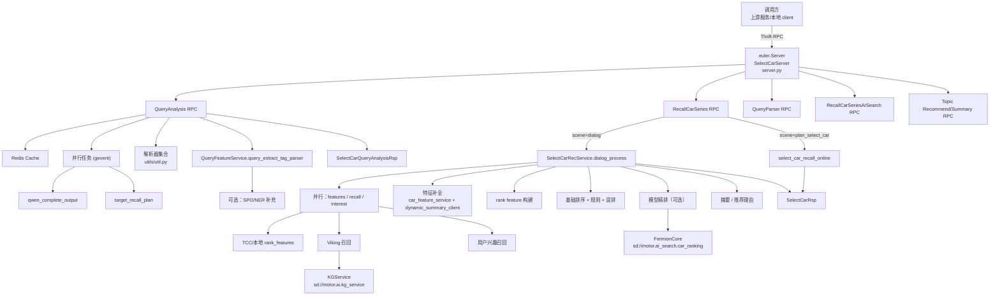
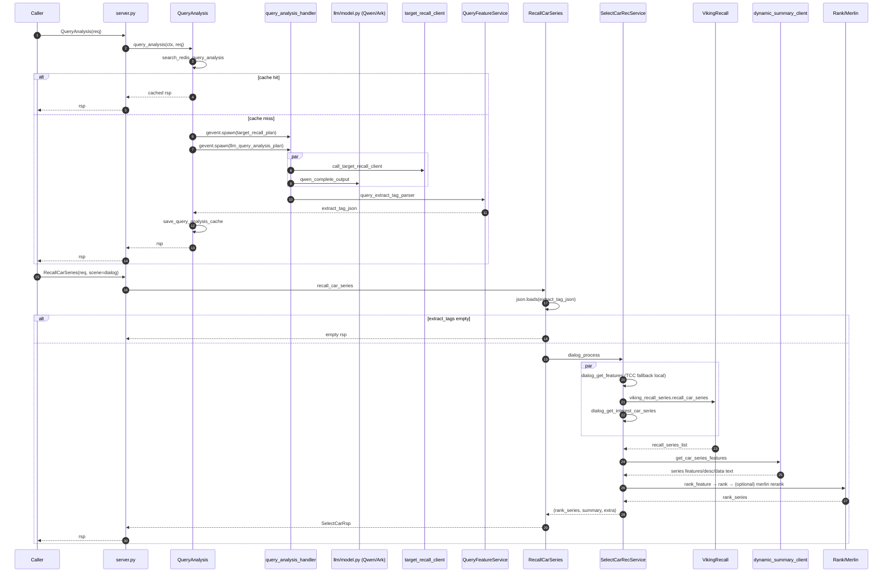

# Select Car Feature Server

这个服务本质是"先把用户的话翻译成机器可执行的选车条件，再用条件去召回并排序车系，最后把结果包装成可解释的推荐"。具体流程大致是：

用户输入一个选车问题，系统先做理解分析，用 LLM 并行产出对需求的结构化解读（显性 / 隐性需求、可用于检索的子问题、按统一字段体系抽出的标签条件），同时并行做一次"目标车系/车款识别"补充可能提到的车型。这些结果被规范化成一份统一的"标签与特征"，并可缓存以加速重复请求。接着进入选车主流程：把结构化标签转成可执行的过滤/召回条件，优先用图谱 / 检索服务召回一批候选车系（必要时对过严条件做降级重启召回），再对候选车系补齐关键信息和描述文本，然后进入多阶段排序：基础打分 + 规则校正 → 配置启用精排 / 重排 → 多样性策略，最终生成摘要和排序好的车系列表，并把召回规模、打分细节、命中标签等调试信息写在扩展字段里便于分析与迭代。

# 1. 系统目标与边界

- **目标**：对用户选车 query 做理解与结构化（改写 / 子问题 / 标签抽取 / 目标车系识别），并基于结构化结果召回并排序车系，输出摘要与候选车系列表。
- **形态**：一个 Thrift RPC 服务（基于 `euler.Server`），对外暴露多个 RPC 方法（选车主链路、榜单、AI 搜索、话题、首页推荐、车系一图等）。

主链路只有两步：

1. `QueryAnalysis`：LLM 并行产出 `planning / sub_queries / recall_tags`（以及可选回答要点），并可调用 target recall 服务补充车系 NER。
2. `RecallCarSeries`：把 `extract_tag_json` 转成内部 `query_features`，走召回（Viking KG recall）→ 特征补全（dynamic summary 等）→ 排序 / 重排（含规则、模型服务）→ 生成 summary → 返回车系列表。

RPC 入口和注册都在 [server.py](file:///cloudide/workspace/select_car_feature_server/server.py)。

# 2. 仓库地图

**RPC 服务入口**

- [server.py](file:///cloudide/workspace/select_car_feature_server/server.py)：euler server 初始化、RPC 方法注册、请求拼装与 response 组装。

**LLM**

- [llm/prompt.py](file:///cloudide/workspace/select_car_feature_server/llm/prompt.py)：所有 prompt 模板。
- [llm/model.py](file:///cloudide/workspace/select_car_feature_server/llm/model.py)：Ark / Qwen HTTP 调用封装（同步 / 异步 / 并发）。

**Query 理解与结构化**

- [handler/query_analysis_handler.py](file:///cloudide/workspace/select_car_feature_server/handler/query_analysis_handler.py)：QueryAnalysis 的并行 LLM 调用与解析、target recall 补充。
- [utils/util.py](file:///cloudide/workspace/select_car_feature_server/utils/util.py)：解析器集合（`extract_tag_parse / planning_parse / decomposition_parse / analysis_parse / rewrite_parse ...`）。

**选车召回与排序（核心业务）**

- [services/select_car_rec_service.py](file:///cloudide/workspace/select_car_feature_server/services/select_car_rec_service.py)：dialog 主流程（并行抽特征 / 召回 / 兴趣车系），召回后排序、重排、summary、标签融合。
- [services/car_query_feature_service.py](file:///cloudide/workspace/select_car_feature_server/services/car_query_feature_service.py)：把"标签抽取结果"转成内部可召回的 `SearchQueryFeature / Feature / Property`。
- [services/car_viking_recall_service.py](file:///cloudide/workspace/select_car_feature_server/services/car_viking_recall_service.py)：基于 filters 调用 Viking KG 服务召回车款 / 聚合车系 / 重启召回。
- 排序 / 重排依赖较多：规则、Merlin / Fermion 模型服务、dynamic summary 特征拼接等。

**Thrift IDL**

- [idls/idl/motor_select_car.thrift](file:///cloudide/workspace/select_car_feature_server/idls/idl/motor_select_car.thrift)：主 RPC 的所有 request / response 结构定义。

**配置与资源**

- [config/application.yml](file:///cloudide/workspace/select_car_feature_server/config/application.yml)：LLM endpoint、召回开关、配置文件路径等。
- [config/feature_config/](file:///cloudide/workspace/select_car_feature_server/config/feature_config)：标签体系、映射表、模板等大量 JSON（系统"规则/知识"核心资产）。

# 3. 对外 RPC 接口

全部在 [server.py](file:///cloudide/workspace/select_car_feature_server/server.py) 注册，核心如下：

- `QueryAnalysis(SelectCarQueryAnalysisReq) -> SelectCarQueryAnalysisRsp`
- `RecallCarSeries(SelectCarReq) -> SelectCarRsp`，`scene="dialog"` 或 `"plan_select_car"`。
- `QueryParser`：判断 query 是否选车意图。
- `RecallCarRankingSeries`：榜单类召回。
- `SelectRecallTagAnalysis`：把 LLM 原始召回标签文本解析并标准化成 `extract_tag_json`。
- 其他：`RecallCarSeriesAISearch / GetTopicRecommend / GetTopicSummary / HomeCarRec / GetCarOnePic / CarExtraction`。

字段定义见 [motor_select_car.thrift](file:///cloudide/workspace/select_car_feature_server/idls/idl/motor_select_car.thrift#L42-L259)。

# 4. 标签 / 特征的三种形态

改 Query 侧算法的时候，第一件要搞清楚的事是：系统里"标签/特征"其实有三种表达形态，越往后越严格。

## 4.1 LLM 原始"标签抽取"文本

- Prompt：`PROMPTS["extract_prompt_all"] / extract_prompt_v3` 等，见 [llm/prompt.py](file:///cloudide/workspace/select_car_feature_server/llm/prompt.py)。
- 解析：`extract_tag_parse(text)`，见 [utils/util.py:L383-L409](file:///cloudide/workspace/select_car_feature_server/utils/util.py#L383-L409)。
- 输出：
  - `is_select_car_intent: bool`
  - `extract_tags_list: List[[field_name, value, requirement]]`
  - 例：`["车辆价格", [10,20], "必要"]`

## 4.2 QueryAnalysis 的中间结构 `extract_tags`

```python
extract_tags = {
  "tags": extract_tags_list,
  "features": [],
  "recall_prompt_tags": extract_output,
}
```

组装位置见 [query_analysis_handler.llm_query_analysis_plan](file:///cloudide/workspace/select_car_feature_server/handler/query_analysis_handler.py#L36-L99)。

## 4.3 真正喂给 RecallCarSeries 的 `extract_tag_json`

`RecallCarSeries.req.extract_tag_json` 是一个 string，解析出来是 `List[dict]`，每个元素大致形如：

```json
{
  "level": "车辆价格",
  "desc": "车辆价格",
  "entity": "车辆价格",
  "sentiment": true,
  "weight": 1.0,
  "is_reason": false,
  "entity_feature_type": "CONFIG",
  "search_key": "...",
  "is_match": true,
  "features": [
    {
      "key": "...",
      "param": "...",
      "sentiment": true,
      "use_type": "RECALL|RANK|...",
      "search_key": "...",
      "search_source": "SERIES|CAR|...",
      "search_type": "ENUM|RANGE|...",
      "source": "CONFIG|SUBJECT|...",
      "is_default": false,
      "sort_type": "NONE|ASC|DESC",
      "weight": 1.0,
      "concat": "",
      "range_type": "",
      "range_unit": ""
    }
  ]
}
```

生成逻辑在 [QueryFeatureService.query_extract_tag_parser](file:///cloudide/workspace/select_car_feature_server/services/car_query_feature_service.py#L657-L723)。

`scene="dialog"` 时 [server.py:L68-L103](file:///cloudide/workspace/select_car_feature_server/server.py#L68-L103) 会把 `req.extract_tag_json` 解析成 list 直接喂给 `SelectCarRecService.dialog_process(...)`，**所以训练/推理产出的标签最终必须落到这个结构**，否则召回/排序链路根本不认。

# 5. 主链路时序

## 5.1 QueryAnalysis

入口：[server.QueryAnalysis](file:///cloudide/workspace/select_car_feature_server/server.py#L331-L416)。关键步骤：

- Cache 命中 → 直接返回：`search_redis_query_analysis(query, context, version)`。
- 视频场景特殊改写：`context.startswith("video_needs")` 时只做 rewrite。
- 并行（gevent）：
  - `target_recall_plan(query, city)`：调用 `rpc.target_recall_client`，见 [query_analysis_handler.py:L245-L274](file:///cloudide/workspace/select_car_feature_server/handler/query_analysis_handler.py#L245-L274)。
  - `llm_query_analysis_plan(query, req, context, cate)`：qwen / llm 并行产出 user_needs（planning）/ sub_queries / recall_tags /（可选）express_elements，见 [query_analysis_handler.py:L36-L99](file:///cloudide/workspace/select_car_feature_server/handler/query_analysis_handler.py#L36-L99)。
- 把 `llm_extract_tags` 规范化成 `extract_tag_json`：`process_service.query_service.query_extract_tag_parser(query, llm_extract_tags, query_entities=...)`。
- Cache 写回：`save_query_analysis_cache(...)`。

输出字段：`analysis_json / sub_queries / extract_tag_json / extract_recall_tags / rewrite_query / forward_prompt`。

## 5.2 RecallCarSeries（dialog 场景）

入口：[server.RecallCarSeries](file:///cloudide/workspace/select_car_feature_server/server.py#L52-L173)。

- `extract_tags` 为空 → 直接返回空结果（[L85-L92](file:///cloudide/workspace/select_car_feature_server/server.py#L85-L92)）。
- 调用 `SelectCarRecService.dialog_process(req, extract_tags, version, ab_version, recall_rank_version, car_ner_list, need_data_list, agentic_tool_plans)`。

`dialog_process` 内部的分段：

1. **并行**：`dialog_get_features`（拿本次排序用的 feature keys，TCC 或本地 `rank_features.json` fallback）、`dialog_recall`（默认 Viking）、`dialog_get_interest_car_series`（兴趣车系，可 stub）。
2. **召回结果补全**：`car_feature_service.get_car_series_features(...)`，从 dynamic summary / 车库服务补齐车系特征（强依赖外部服务，可先 stub）。
3. **排序 / 重排**：simple rank / adaptive_reranking / Merlin 模型精排。离线时可降级为"按召回分或热度排序"。
4. **summary 生成**：`car_summary_service.user_intent_process(...)`（可先 stub）。
5. **返回协议拼装**：`CarSeriseData` 填充 `rank_score / rerank_score / car_series_feature / data_feature / ...`，见 [server.py:L124-L172](file:///cloudide/workspace/select_car_feature_server/server.py#L124-L172)。

# 6. 架构与时序图

## 架构总览



## 主链路时序



# 7. 外部依赖

这个仓库业务逻辑完整，但运行时严重依赖外部服务与内部 SDK。复现时必须分层替换。

**Thrift / 服务框架**

- `bytedeuler / euler`：Thrift server/client + 动态 thrift import hook。服务端见 [server.py:L45-L51](file:///cloudide/workspace/select_car_feature_server/server.py#L45-L51)，客户端示例 [client.py](file:///cloudide/workspace/select_car_feature_server/client.py#L19-L121)。
- 仓库里没有生成的 `*_thrift.py`，运行时依赖 euler thrift hook 才能 import。

**LLM**

- Ark：`llm_complete / llm_complete_output`，见 [llm/model.py:L103-L153](file:///cloudide/workspace/select_car_feature_server/llm/model.py#L103-L153)。
- Qwen HTTP：`qwen_complete_output(url, model_name, ...)`，见 [llm/model.py:L62-L102](file:///cloudide/workspace/select_car_feature_server/llm/model.py#L62-L102)。
- 配置来源：[config/application.yml:L10-L13](file:///cloudide/workspace/select_car_feature_server/config/application.yml#L10-L13) 给了 `endpoint_id`。QueryAnalysis 还允许用 `req.ab_json` 覆盖 `llm.url / llm.model_name`（[query_analysis_handler.py:L64-L66](file:///cloudide/workspace/select_car_feature_server/handler/query_analysis_handler.py#L64-L66)）。
- 风险：[llm/model.py:L12-L14](file:///cloudide/workspace/select_car_feature_server/llm/model.py#L12-L14) 存在硬编码 `api_key`，必须迁到环境变量。

**召回 / 特征 / 排序**

- Viking KG 召回：`rpc.viking_recall_client`（`sd://motor.ai.kg_service`），见 [viking_recall_client.py:L39-L174](file:///cloudide/workspace/select_car_feature_server/rpc/viking_recall_client.py#L39-L174)。
- dynamic summary / 车系特征补全：`rpc.dynamic_summary_client`。
- TCC 配置：`bytedtcc.ClientV2`，失败 fallback 本地 `config/feature_config/rank_features.json`，见 [select_car_rec_service.py:L78-L92](file:///cloudide/workspace/select_car_feature_server/services/select_car_rec_service.py#L78-L92)。
- Merlin / Fermion 排序：`sd://motor.ai_search.car_ranking`，见 [car_rank_merlin_service.py:L180-L209](file:///cloudide/workspace/select_car_feature_server/services/car_rank_merlin_service.py#L180-L209)。
- Redis：`bytedredis.Client("toutiao.redis.select_car_data")`，见 [cache_redis_client.py:L9-L35](file:///cloudide/workspace/select_car_feature_server/rpc/cache_redis_client.py#L9-L35)。
- 车库 / 价格 / 评测 / 口碑等：大量 `rpc/*_client.py`（`sd://motor.xxx`）。

如果复现环境拿不到这些 `sd://` 服务和内部 SDK，就必须走离线替身方案（见第 9 节）。

# 8. 本地启动 SOP（生产近似复现）

前提：环境可以装 `bytedeuler / bytedredis / bytedtcc / bytedes / ...`，网络能访问 `sd://` 服务和火山 Ark。

1. **Python 环境**：推荐 3.9；`pip install -r requirements.txt`。
2. **检查配置**：[config/application.yml](file:///cloudide/workspace/select_car_feature_server/config/application.yml) 里 `llm.endpoint_id / doubao_endpoint_id / viking.use_viking_recall / es.ues_recall`（拼写就是 `ues_recall`，别手贱改）。
3. **启动**：[bootstrap.sh](file:///cloudide/workspace/select_car_feature_server/bootstrap.sh) 实际执行 `python -m gevent.monkey server.py`，监听 `tcp://0.0.0.0:1234`。
4. **验证**：用 [client.py](file:///cloudide/workspace/select_car_feature_server/client.py) 的 pipeline，先 `QueryAnalysis`，再把 `analysis_json / sub_queries / extract_tag_json` 填回 `SelectCarReq` 调 `RecallCarSeries`。样例函数 `test_pipeline / scratch_seroes`。

# 9. 离线复现 SOP（Stub 所有外部依赖）

目标是在没有内网的情况下跑通逻辑 + 验证输出结构。四个 Level：

1. **服务能启动 + RPC 可调用**：允许 QueryAnalysis / RecallCarSeries 返回空但结构正确。
2. **QueryAnalysis 不依赖外部 LLM**：用本地 deterministic 规则 / fixture 输出 `llm_outputs / extract_tags / sub_queries`。
3. **RecallCarSeries 不依赖 Viking / dynamic / merlin**：用本地小车系库（20 条左右）做召回排序。
4. **逐步接回真实能力**：先接 LLM → Viking → dynamic summary → 排序模型。

需要 Stub 的关键点（按调用频率）：

- LLM：替换 [llm/model.py](file:///cloudide/workspace/select_car_feature_server/llm/model.py) 的 `llm_complete* / qwen_complete_output`，保持 prompt → output 解析格式一致。
- Viking recall：替换 [viking_recall_client.py](file:///cloudide/workspace/select_car_feature_server/rpc/viking_recall_client.py) 的 `call_recall_car_client / call_tag_recall_client`。
- dynamic summary：替换 `rpc.dynamic_summary_client` 中所有 `call_*`。
- Merlin / Fermion 排序：让 `inferByFeatures` 直接按已有字段排序。
- Redis / TCC：走本地内存 / 本地 JSON（TCC 本来就有本地 fallback）。

最小离线数据集：

- 车系基础表：`series_id / series_name / 若干特征 / 描述`。
- 标签映射 / 字段体系：直接复用 [config/feature_config](file:///cloudide/workspace/select_car_feature_server/config/feature_config)。
- rank_features：本地 `config/feature_config/rank_features.json`（代码已有 fallback）。

回归用例（用 [client.py](file:///cloudide/workspace/select_car_feature_server/client.py) 的 pipeline）：

- 典型选车：预算 / 车型 / 能源 / 座位数 / 用途混合。
- 非选车：应被 QueryParser / QueryAnalysis 判为无需检索或返回空 tags。
- 候选车系明确：带车系名，验证"候选车系"路径。

验收：

- `QueryAnalysisRsp.extract_tag_json` 是合法 JSON，每个元素都有 `level / entity / features[]`。
- `RecallCarSeriesRsp.car_list` 返回 `CarSeriseData` 列表，至少有 `car_series_id / name / desc`，`BaseResp.StatusCode==0`。

# 10. 算法迭代指南

按"你要改什么 → 应该改哪里 → 最小回归"组织。

## 改 QueryAnalysis 的 LLM 行为

改动点：prompt 文案、输出格式、并行 task 数、token 上限、模型选择。

- Prompt：[llm/prompt.py](file:///cloudide/workspace/select_car_feature_server/llm/prompt.py) 的 `query_planning_base / query_decomposition_all / extract_prompt_all / query_express_elements`。
- 并行任务编排：[query_analysis_handler.py:L45-L50](file:///cloudide/workspace/select_car_feature_server/handler/query_analysis_handler.py#L45-L50) 有默认 tasks。线上灰度优先用 `req.ab_json.parallel_tasks` 覆盖 enable / max_tokens / key / name，而不是改代码。
- 解析器必须同步跟上：`planning_parse / decomposition_parse / extract_tag_parse`。

最小回归：`QueryAnalysisRsp.extract_tag_json` 必须是合法 JSON，非空时每个元素至少含 `level / entity / features[]`；非选车 query 的 `flag=False` 路径仍能稳定触发（避免误召回）。

## 改"标签抽取 → 可执行召回特征"的映射（最敏感）

改动点：新增字段（比如"露营/越野/家庭"映射到某个 property）、改枚举值映射（车身级别 / 能源类型 / 变速箱 / 驱动形式）、改倾向性（必要 / 强烈 / 一般 / 排除）对过滤的作用方式。

重点看两段：

- `QueryFeatureService.query_extract_tag_parser`：LLM tags → 结构化 `extract_tag_json`（[L657-L723](file:///cloudide/workspace/select_car_feature_server/services/car_query_feature_service.py#L657-L723)）。
- `QueryFeatureService.extract_tag_to_feature`：`extract_tag_json` → `SearchQueryFeature / Feature / Property`（[L725-L769](file:///cloudide/workspace/select_car_feature_server/services/car_query_feature_service.py#L725-L769)）。

必须保证的兼容性：dialog 场景的 `SelectCarReq.extract_tag_json` 就走上面的结构，改了会直接影响召回/排序。任何新增字段必须能在 `key_param2property` 或特殊分支中落到 `Property`，否则会被 `continue` 丢掉（[L758-L764](file:///cloudide/workspace/select_car_feature_server/services/car_query_feature_service.py#L758-L764)）。

最小回归（3 类 query）：

- 范围类（价格 / 续航 / 年份）→ `RANGE` 分支。
- 枚举类（车型 / 能源 / 座位数）→ `ENUM` 分支。
- 排除类（"不考虑 SUV / 不要隐藏式门把手"）→ `sentiment=False` 或 MUST_NOT。

## 改召回策略（Viking / ES / 混合）

改动点：召回源切换、topk、重启召回、subject tag 的 KG 召回权重 / 阈值。

- dialog 召回入口：[SelectCarRecService.dialog_recall](file:///cloudide/workspace/select_car_feature_server/services/select_car_rec_service.py#L142-L208)。SUBJECT / 未命中标签会进入 `kg_ents`。
- 真正召回函数：`self.viking_recall_series.recall_car_series(...)`。
- Viking 实现：[car_viking_recall_service.py](file:///cloudide/workspace/select_car_feature_server/services/car_viking_recall_service.py)。底层 RPC 在 [rpc/viking_recall_client.py](file:///cloudide/workspace/select_car_feature_server/rpc/viking_recall_client.py)。

最小回归：强约束 query（很多必要条件）不能直接召回 0，要么非空，要么能触发 `restart_recall_query` 降级。弱约束 query（只要热门 / 省油）召回规模要合理，`extra_info.recall_size` 可观测。

## 改排序 / 精排模型

改动点：精排模型版本 / 输入模板、特征选择（keys）、需要的数据块（`need_data_list / agentic_tool_plans`）。

- Merlin：[car_rank_merlin_service.py](file:///cloudide/workspace/select_car_feature_server/services/car_rank_merlin_service.py)。`process_agentic_tool_plans` 把 tool plan 映射到 `CarData`（[L86-L121](file:///cloudide/workspace/select_car_feature_server/services/car_rank_merlin_service.py#L86-L121)）；`features_summary2feature_map` 从 dynamic summary 返回中取指定数据块（[L123-L179](file:///cloudide/workspace/select_car_feature_server/services/car_rank_merlin_service.py#L123-L179)）。
- Keys 来源：`rank_extract_features`（TCC）失败时 fallback 本地 `rank_features.json`（[L78-L92](file:///cloudide/workspace/select_car_feature_server/services/select_car_rec_service.py#L78-L92)）。

最小回归：精排开关打开 / 关闭两条路径都能跑通（AB 参数控）；`CarSeriseData.rank_score / rerank_score` 不为默认值且排序与分数一致。

# 11. 回归用例与验收

必测用例（最少 8 条）：

1. 典型约束：`预算 10 万以内 5 座 SUV 油耗低`。
2. 复杂约束：`7 座 / 大空间 / 通勤 + 带娃 / 能装行李 / 预算 15-20`。
3. 排除条件：`不要 SUV 不要隐藏式门把手`。
4. 候选车系显式：`宋 PLUS DM-i 和 银河 L7 怎么选`（验证候选车系路径）。
5. 非选车：`明年会有汽车补贴吗`（不走召回或返回空）。
6. 榜单类：`电车排行榜前十名`。
7. 视频场景改写：`context=video_needs...`（只改写）。
8. 弱约束：`省油 质量可靠`（召回规模和排序稳定）。

验收口径：

- QueryAnalysis：`BaseResp.StatusCode==0`；`analysis_json` 合法 JSON string；`extract_tag_json` 合法 JSON list string。
- RecallCarSeries（dialog）：`extract_tag_json` 非空时 `car_list` 非空（除非明确非选车）；`extra_info` 至少包含 `recall_size / rank_series`（[server.py:L106-L167](file:///cloudide/workspace/select_car_feature_server/server.py#L106-L167)）；`CarSeriseData.car_series_id / name / desc` 有值（desc 依赖 dynamic summary）。

# 12. AB 参数与可观测性

AB 参数入口：

- `SelectCarReq.ab_json`（Recall 阶段）。
- `SelectCarQueryAnalysisReq.ab_json`（QueryAnalysis 阶段）。

常见用途：

- QueryAnalysis：并行 task / qwen url / model / token 上限（[query_analysis_handler.py:L45-L66](file:///cloudide/workspace/select_car_feature_server/handler/query_analysis_handler.py#L45-L66)）。
- Recall / Rank：topk / rank 阈值 / 候选数 / 是否启用精排（在 [select_car_rec_service.py] 内 `json_get(ab_params, ["rank_params", ...])`）。

可观测 debug 字段：

- RecallCarSeries 的 `extra_info`：`recall_size / rank_series / rerank_result / simple_rank_result / kg_recall_ents / tag_selected_map`（[server.py:L104-L167](file:///cloudide/workspace/select_car_feature_server/server.py#L104-L167)）。
- QueryAnalysis 返回 `llm_outputs`（各 task 原始 output）和 `target_info_json`（target recall NER）（[server.py:L400-L408](file:///cloudide/workspace/select_car_feature_server/server.py#L400-L408)）。

日志：loguru + bytedlogger handler，见 [utils/log.py](file:///cloudide/workspace/select_car_feature_server/utils/log.py)。

# 13. 风险 & 约束

- **强依赖外部 RPC**：Viking KG、dynamic summary、Merlin / Fermion、Redis、TCC。
- **强格式约束**：LLM 输出格式偏一下（JSON 不可 parse / 标签块不完整）→ `extract_tag_json` 空 → dialog 场景直接无结果。
- **配置依赖**：大量标签体系和映射在 [config/feature_config](file:///cloudide/workspace/select_car_feature_server/config/feature_config)。
- **安全**：[llm/model.py](file:///cloudide/workspace/select_car_feature_server/llm/model.py) 硬编码 api_key，必须迁到环境变量 / 密钥服务。
